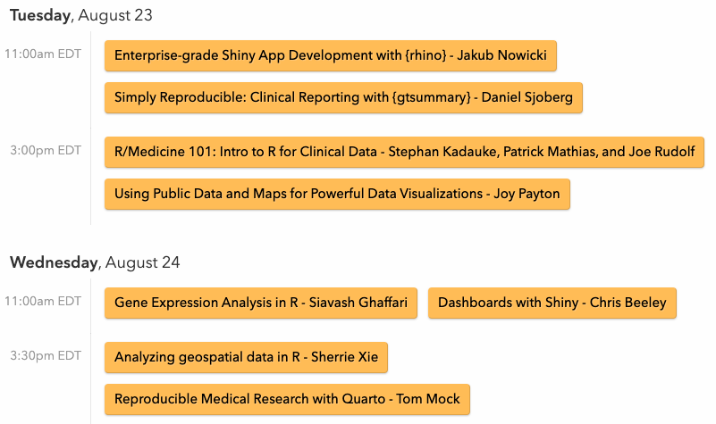
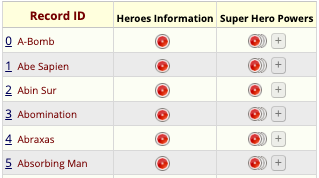
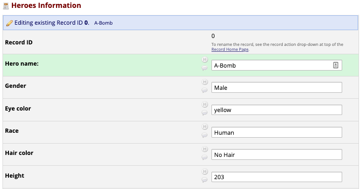
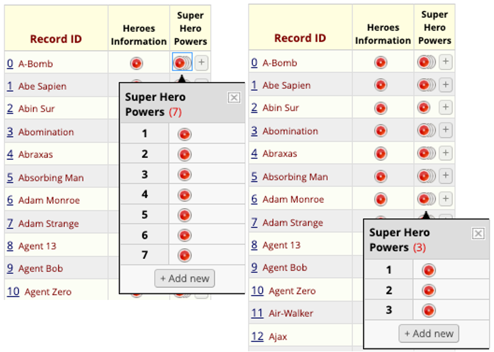
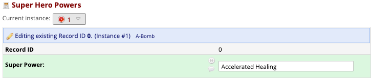
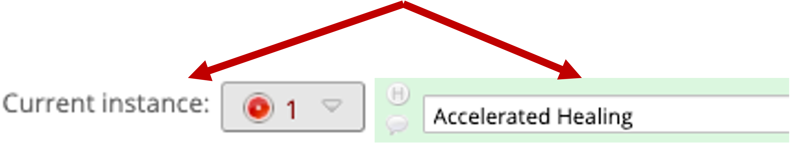
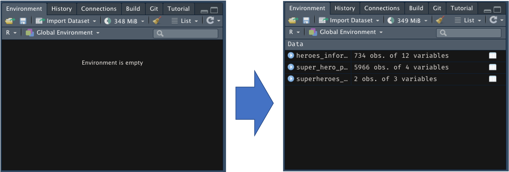
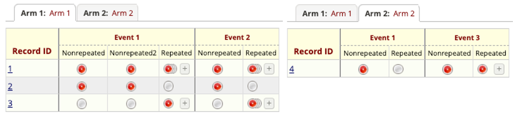

## Who am I?

::: columns
::: {.column width="60%"}
{width="500"}
:::

::: {.column width="40%"}
-   CGT DataOps Data Scientist
-   5 years at CHOP
-   Engineering background
-   Trying to implement `quarto` today[^1]
:::
:::

[^1]: Huge shoutout to Jake Riley for helping troubleshoot `quarto` and `kableExtra`

::: notes
I am a data scientist in the Cell & Gene Therapy Data Operations team. I joined CHOP about 5 years ago coming from a mechanical engineering background and about 4 years ago found my way into coding with R to solve problems, make products, you name it. Around that same time I met Stephan Kadauke who leads the DataOps team and helped found the R User Group and that more or less brings me in front of you today.

Around the same time I started using R I was working with REDCap, and I found that the two go hand in hand rather well. Today I'm excited to talk to you about a package we're developing that, for those of you also working with both R and REDCap, may hopefully become a useful tool to help your analytic processes.

A quick shoutout also to Jake Riley. This is my first time doing a quarto presentation (quarto is the new rmarkdown) and he helped considerably with my frustrations over getting tables to render better in the slides. So thanks Jake!
:::

## R / Medicine 2022 {.smaller}

[{fig-align="center"}](https://events.linuxfoundation.org/r-medicine/)

> `https://events.linuxfoundation.org/r-medicine/`

::: notes
Real quick, before we jump into our talk wanted to give a brief announcement to remind or alert everyone to the upcoming R / Medicine conference. This will be an entirely virtual conference with the first two days dedicated to some excellent workshops and a series of speakers for the latter two, all of which can be found on the schedule at the website here.
:::

## R / Medicine 2022 - Workshops {.smaller}

[{fig-align="center"}](https://events.linuxfoundation.org/r-medicine/program/schedule/)

> Discount Code: **RMED22CHOP** for 10% off!

## R / Medicine 2022 - Speaker Highlights {.smaller}

-   **Stephan Kadauke (CHOP CGT DataOps)**
    -   [*R/Medicine 101: Intro to R for Clinical Data*]{style="color: #008cba;"}

    -   [*Should we Teach Data Science to Physicians-in-Training?*]{style="color: #008cba;"}
-   **Joy Payton (CHOP Arcus Education)**
    -   [*Using Public Data and Maps for Powerful Data Visualizations*]{style="color: #008cba;"}
-   **Lihai Song (CHOP Data Scientist)**
    -   [*Automation of statistics summary and analysis using R Shiny*]{style="color: #008cba;"}
-   **Jaclyn Janis (RStudio/Posit, CHOP Representative)**
    -   [*It's time for nurses to learn R*]{style="color: #008cba;"}

::: notes
We also have some familiar faces who will be delivering workdshops and talks including Stephan Kadauke, Joy Payton, and Lihai Song from CHOP as well as Jaclyn Janis our customer success rep from RStudio (now known as Posit).
:::

## Agenda

In today's talk we will:

-   Review what REDCap is 💡
-   Review `REDCapR` as an extraction tool for the API 🔌
-   Implement `REDCapTidieR` to make our lives easier 🧹

What you need:

-   Familiarity with R 💻
-   Familiarity with REDCap 🧢

::: notes
Today's talk will primarily be beneficial to those of you who have some familiarity with R, namely how to work your way around with the tidyverse and especially those familiar with the REDCapR package, but we will also briefly touch on what REDCap is, how REDCapR works, and the use case that called for REDCapTidieR in the first place.
:::

## What is REDCap? {.smaller}

{fig-align="center" width="450"}

-   Free[^2] database solution for research
-   Secure and accessible from a web browser
-   Can collect "any type of data in any environment"
-   Particularly useful for compliance with 21 CFR Part 11, HIPAA, etc.
-   Requires little to get up and running, but offers complexity as needed

[^2]: For participants of the REDCap consortium

::: notes
REDCap is a powerful database solution used by many research institutions. The web interface offers a secure, accessible way to architect databases of varying complexity at no cost to the institution for joining the REDCap consortium.

You can access REDCap on the web from anywhere, and it can store any data you can realistically imagine for research purposes. It is also attractive to research institutions for being capable of clearance for various compliance requirements.

In my opinion, REDCap is strongest in it's front end UI ability to supply users with the tools to make databases quickly and with plenty of customization, but also provides complexity to those who wish to use it.
:::

## What is REDCap? {.smaller}

::: columns
::: {.column width="50%"}
Record Status Dashboard {width="457"}
:::

::: {.column width="50%"}
Front-End Data Entry UI {width="800"}
:::
:::

> REDCap functions as a large data table, but data distribution can be complex depending on architectural choices.

> Repeating instances can create headaches on the backend.

::: notes
The REDCap front-end consists of many tools but the two we're interested in are the top-level database display, known as the record status dashboard, and the actual area that data entry personnel enter data.

Here on the left is a visual representation of what essentially amounts to a tabular structure. We have a record ID, and two "instruments" with underlying data. The first is a single sub-table or "form", while the second is stacked or "repeating." We'll touch more on these shortly but they can be a bit cumbersome to work with.

On the right is a drilled-down display where the data gets entered. Here we see all of the Heroes Information associated with Record ID number 0. You can think of these as the column data elements tied to a single row for the hero A-Bomb.

Because of this, as mentioned earlier, REDCap can be about as complex as you want or need it to be.
:::

## The Super Heroes Dataset


::: {.cell hash='REDCapTidieR_cache/revealjs/unnamed-chunk-3_38d03bc96e264b31edd23aa42b70617d'}

:::


Open source dataset from [SuperHeroDB](https://www.superherodb.com/) and available on [Kaggle](https://www.kaggle.com/datasets/claudiodavi/superhero-set). It contains two tables:

-   Super Hero Information (i.e. demographic data)
-   Super Hero Powers (i.e. `TRUE`/`FALSE` for specific powers)


::: notes
So by now you've noticed we aren't using patient data, so it's worth briefly touching on the data we are using. We will be using open source super hero data from SuperHeroDB, delivered via Kaggle. There are two CSV tables available where one contains Hero Information like name, height, weight, eye color, etc. and the other contains a wide table pairing hero names to a boolean of specific powers.

Next let's look at how we're actually going to extract this data using the `REDCapR` package
:::

## On the Shoulders of Giants {.smaller}

::: columns
::: {.column width="60%"}
Some core `REDCapR` functions:

-   `redcap_read_oneshot`
-   `redcap_metadata_read`
-   `redcap_event_instruments`
    -   New as of `v1.1.0`

Requirements:

-   Active REDCap project
-   A REDCap API URI[^3]
-   API token[^4]
:::

::: {.column width="40%"}
{fig-align="right" width="1500"}
:::
:::

[^3]: Such as `https://redcap.chop.edu/api/`

[^4]: Requires user API and Read/Write access

::: notes
We've been using REDCapR extensively for a while, and at it's core the package does all the heavy lifting required to extract data and metadata on a REDCap project from the R console. If we all stand on the shoulders of giants, then `REDCapR` is the giant that REDCapTidieR has to thank.

To get started with API calls through these packages, you need a couple of things. First, an active REDCap database or project. Second, a REDCap API URI (in our case redcap.chop.edu/api/). Third an API token, since this is associated to your user rights you need to make sure you have the appropriate read/write privileges.

Let's assume I've already done the work of preparing and importing this into a REDCap database so we can see what an export of the data looks like via REDCapR.
:::

## SuperHeroes Output {.smaller}


::: {.cell hash='REDCapTidieR_cache/revealjs/unnamed-chunk-4_fa54b690401862665454bcc8af137dd7'}

```{.r .cell-code}
# Load applicable libraries:
library(dplyr)
library(REDCapR)

superheroes_db <- redcap_read_oneshot(redcap_uri, token, verbose = FALSE)$data

superheroes_db %>% 
  glimpse()
```

::: {.cell-output .cell-output-stdout}
```
Rows: 6,700
Columns: 16
$ record_id                   <dbl> 0, 0, 0, 0, 0, 0, 0, 0, 1, 1, 1, 1, 1, 1, …
$ redcap_repeat_instrument    <chr> NA, "super_hero_powers", "super_hero_power…
$ redcap_repeat_instance      <dbl> NA, 1, 2, 3, 4, 5, 6, 7, NA, 1, 2, 3, 4, 5…
$ name                        <chr> "A-Bomb", NA, NA, NA, NA, NA, NA, NA, "Abe…
$ gender                      <chr> "Male", NA, NA, NA, NA, NA, NA, NA, "Male"…
$ eye_color                   <chr> "yellow", NA, NA, NA, NA, NA, NA, NA, "blu…
$ race                        <chr> "Human", NA, NA, NA, NA, NA, NA, NA, "Icth…
$ hair_color                  <chr> "No Hair", NA, NA, NA, NA, NA, NA, NA, "No…
$ height                      <dbl> 203, NA, NA, NA, NA, NA, NA, NA, 191, NA, …
$ weight                      <dbl> 441, NA, NA, NA, NA, NA, NA, NA, 65, NA, N…
$ publisher                   <chr> "Marvel Comics", NA, NA, NA, NA, NA, NA, N…
$ skin_color                  <chr> "-", NA, NA, NA, NA, NA, NA, NA, "blue", N…
$ alignment                   <chr> "good", NA, NA, NA, NA, NA, NA, NA, "good"…
$ heroes_information_complete <dbl> 0, NA, NA, NA, NA, NA, NA, NA, 0, NA, NA, …
$ power                       <chr> NA, "Accelerated Healing", "Durability", "…
$ super_hero_powers_complete  <dbl> NA, 0, 0, 0, 0, 0, 0, 0, NA, 0, 0, 0, 0, 0…
```
:::
:::


Remember `redcap_repeat_instrument` and `redcap_repeat_instance`, they're coming back!

::: notes
Let's first load some applicable libraries and extract both the data and metadata of the database. A glimpse of the database shows us 6,700 rows with 16 columns, but oddly we seem to have a lot of `NA`s/missing data. And what might be a little more confusing is that our record_IDs are being repeated a number of times.

Lastly, there are two variables here (`redcap_repeat_instrument` and `redcap_repeat_instance`) which weren't in our original database from the user side. They'll be coming up a lot today.

Let's look at a tibble structure to see if we can piece why this is.
:::

## SuperHeroes Output {.smaller .scrollable}


::: {.cell hash='REDCapTidieR_cache/revealjs/unnamed-chunk-5_b87d12f7fbedb3dbd6e4a00b13b654aa'}

```{.r .cell-code}
# View first 10 entries of SuperHeroes db tibble
superheroes_db %>% 
  head(10)
```
:::

::: {.cell hash='REDCapTidieR_cache/revealjs/unnamed-chunk-6_9f0f5b09550b0768c56c8cd255dae95a'}
::: {.cell-output-display}
`````{=html}
<div style="border: 1px solid #ddd; padding: 0px; overflow-y: scroll; height:500px; overflow-x: scroll; width:100%; "><table style="width:20%; font-size: 14px; width: auto !important; margin-left: auto; margin-right: auto;" class="table table-striped table-hover table-bordered">
 <thead>
  <tr>
   <th style="text-align:left;position: sticky; top:0; background-color: #FFFFFF;position: sticky; top:0; background-color: #FFFFFF;"> record_id </th>
   <th style="text-align:left;position: sticky; top:0; background-color: #FFFFFF;position: sticky; top:0; background-color: #FFFFFF;"> redcap_repeat_instrument </th>
   <th style="text-align:left;position: sticky; top:0; background-color: #FFFFFF;position: sticky; top:0; background-color: #FFFFFF;"> redcap_repeat_instance </th>
   <th style="text-align:left;position: sticky; top:0; background-color: #FFFFFF;position: sticky; top:0; background-color: #FFFFFF;"> name </th>
   <th style="text-align:left;position: sticky; top:0; background-color: #FFFFFF;position: sticky; top:0; background-color: #FFFFFF;"> gender </th>
   <th style="text-align:left;position: sticky; top:0; background-color: #FFFFFF;position: sticky; top:0; background-color: #FFFFFF;"> eye_color </th>
   <th style="text-align:left;position: sticky; top:0; background-color: #FFFFFF;position: sticky; top:0; background-color: #FFFFFF;"> race </th>
   <th style="text-align:left;position: sticky; top:0; background-color: #FFFFFF;position: sticky; top:0; background-color: #FFFFFF;"> hair_color </th>
   <th style="text-align:left;position: sticky; top:0; background-color: #FFFFFF;position: sticky; top:0; background-color: #FFFFFF;"> height </th>
   <th style="text-align:left;position: sticky; top:0; background-color: #FFFFFF;position: sticky; top:0; background-color: #FFFFFF;"> weight </th>
   <th style="text-align:left;position: sticky; top:0; background-color: #FFFFFF;position: sticky; top:0; background-color: #FFFFFF;"> publisher </th>
   <th style="text-align:left;position: sticky; top:0; background-color: #FFFFFF;position: sticky; top:0; background-color: #FFFFFF;"> skin_color </th>
   <th style="text-align:left;position: sticky; top:0; background-color: #FFFFFF;position: sticky; top:0; background-color: #FFFFFF;"> alignment </th>
   <th style="text-align:left;position: sticky; top:0; background-color: #FFFFFF;position: sticky; top:0; background-color: #FFFFFF;"> heroes_information_complete </th>
   <th style="text-align:left;position: sticky; top:0; background-color: #FFFFFF;position: sticky; top:0; background-color: #FFFFFF;"> power </th>
   <th style="text-align:left;position: sticky; top:0; background-color: #FFFFFF;position: sticky; top:0; background-color: #FFFFFF;"> super_hero_powers_complete </th>
  </tr>
 </thead>
<tbody>
  <tr>
   <td style="text-align:left;font-weight: bold;"> <span style="     color: black !important;">0</span> </td>
   <td style="text-align:left;"> <span style=" font-weight: bold;    color: red !important;">NA</span> </td>
   <td style="text-align:left;"> <span style=" font-weight: bold;    color: red !important;">NA</span> </td>
   <td style="text-align:left;"> <span style="     color: black !important;">A-Bomb</span> </td>
   <td style="text-align:left;"> <span style="     color: black !important;">Male</span> </td>
   <td style="text-align:left;"> <span style="     color: black !important;">yellow</span> </td>
   <td style="text-align:left;"> <span style="     color: black !important;">Human</span> </td>
   <td style="text-align:left;"> <span style="     color: black !important;">No Hair</span> </td>
   <td style="text-align:left;"> <span style="     color: black !important;">203</span> </td>
   <td style="text-align:left;"> <span style="     color: black !important;">441</span> </td>
   <td style="text-align:left;"> <span style="     color: black !important;">Marvel Comics</span> </td>
   <td style="text-align:left;"> <span style="     color: black !important;">-</span> </td>
   <td style="text-align:left;"> <span style="     color: black !important;">good</span> </td>
   <td style="text-align:left;"> <span style="     color: black !important;">0</span> </td>
   <td style="text-align:left;"> <span style=" font-weight: bold;    color: red !important;">NA</span> </td>
   <td style="text-align:left;"> <span style=" font-weight: bold;    color: red !important;">NA</span> </td>
  </tr>
  <tr>
   <td style="text-align:left;font-weight: bold;"> <span style="     color: black !important;">0</span> </td>
   <td style="text-align:left;"> <span style="     color: black !important;">super_hero_powers</span> </td>
   <td style="text-align:left;"> <span style="     color: black !important;">1</span> </td>
   <td style="text-align:left;"> <span style=" font-weight: bold;    color: red !important;">NA</span> </td>
   <td style="text-align:left;"> <span style=" font-weight: bold;    color: red !important;">NA</span> </td>
   <td style="text-align:left;"> <span style=" font-weight: bold;    color: red !important;">NA</span> </td>
   <td style="text-align:left;"> <span style=" font-weight: bold;    color: red !important;">NA</span> </td>
   <td style="text-align:left;"> <span style=" font-weight: bold;    color: red !important;">NA</span> </td>
   <td style="text-align:left;"> <span style=" font-weight: bold;    color: red !important;">NA</span> </td>
   <td style="text-align:left;"> <span style=" font-weight: bold;    color: red !important;">NA</span> </td>
   <td style="text-align:left;"> <span style=" font-weight: bold;    color: red !important;">NA</span> </td>
   <td style="text-align:left;"> <span style=" font-weight: bold;    color: red !important;">NA</span> </td>
   <td style="text-align:left;"> <span style=" font-weight: bold;    color: red !important;">NA</span> </td>
   <td style="text-align:left;"> <span style=" font-weight: bold;    color: red !important;">NA</span> </td>
   <td style="text-align:left;"> <span style="     color: black !important;">Accelerated Healing</span> </td>
   <td style="text-align:left;"> <span style="     color: black !important;">0</span> </td>
  </tr>
  <tr>
   <td style="text-align:left;font-weight: bold;"> <span style="     color: black !important;">0</span> </td>
   <td style="text-align:left;"> <span style="     color: black !important;">super_hero_powers</span> </td>
   <td style="text-align:left;"> <span style="     color: black !important;">2</span> </td>
   <td style="text-align:left;"> <span style=" font-weight: bold;    color: red !important;">NA</span> </td>
   <td style="text-align:left;"> <span style=" font-weight: bold;    color: red !important;">NA</span> </td>
   <td style="text-align:left;"> <span style=" font-weight: bold;    color: red !important;">NA</span> </td>
   <td style="text-align:left;"> <span style=" font-weight: bold;    color: red !important;">NA</span> </td>
   <td style="text-align:left;"> <span style=" font-weight: bold;    color: red !important;">NA</span> </td>
   <td style="text-align:left;"> <span style=" font-weight: bold;    color: red !important;">NA</span> </td>
   <td style="text-align:left;"> <span style=" font-weight: bold;    color: red !important;">NA</span> </td>
   <td style="text-align:left;"> <span style=" font-weight: bold;    color: red !important;">NA</span> </td>
   <td style="text-align:left;"> <span style=" font-weight: bold;    color: red !important;">NA</span> </td>
   <td style="text-align:left;"> <span style=" font-weight: bold;    color: red !important;">NA</span> </td>
   <td style="text-align:left;"> <span style=" font-weight: bold;    color: red !important;">NA</span> </td>
   <td style="text-align:left;"> <span style="     color: black !important;">Durability</span> </td>
   <td style="text-align:left;"> <span style="     color: black !important;">0</span> </td>
  </tr>
  <tr>
   <td style="text-align:left;font-weight: bold;"> <span style="     color: black !important;">0</span> </td>
   <td style="text-align:left;"> <span style="     color: black !important;">super_hero_powers</span> </td>
   <td style="text-align:left;"> <span style="     color: black !important;">3</span> </td>
   <td style="text-align:left;"> <span style=" font-weight: bold;    color: red !important;">NA</span> </td>
   <td style="text-align:left;"> <span style=" font-weight: bold;    color: red !important;">NA</span> </td>
   <td style="text-align:left;"> <span style=" font-weight: bold;    color: red !important;">NA</span> </td>
   <td style="text-align:left;"> <span style=" font-weight: bold;    color: red !important;">NA</span> </td>
   <td style="text-align:left;"> <span style=" font-weight: bold;    color: red !important;">NA</span> </td>
   <td style="text-align:left;"> <span style=" font-weight: bold;    color: red !important;">NA</span> </td>
   <td style="text-align:left;"> <span style=" font-weight: bold;    color: red !important;">NA</span> </td>
   <td style="text-align:left;"> <span style=" font-weight: bold;    color: red !important;">NA</span> </td>
   <td style="text-align:left;"> <span style=" font-weight: bold;    color: red !important;">NA</span> </td>
   <td style="text-align:left;"> <span style=" font-weight: bold;    color: red !important;">NA</span> </td>
   <td style="text-align:left;"> <span style=" font-weight: bold;    color: red !important;">NA</span> </td>
   <td style="text-align:left;"> <span style="     color: black !important;">Longevity</span> </td>
   <td style="text-align:left;"> <span style="     color: black !important;">0</span> </td>
  </tr>
  <tr>
   <td style="text-align:left;font-weight: bold;"> <span style="     color: black !important;">0</span> </td>
   <td style="text-align:left;"> <span style="     color: black !important;">super_hero_powers</span> </td>
   <td style="text-align:left;"> <span style="     color: black !important;">4</span> </td>
   <td style="text-align:left;"> <span style=" font-weight: bold;    color: red !important;">NA</span> </td>
   <td style="text-align:left;"> <span style=" font-weight: bold;    color: red !important;">NA</span> </td>
   <td style="text-align:left;"> <span style=" font-weight: bold;    color: red !important;">NA</span> </td>
   <td style="text-align:left;"> <span style=" font-weight: bold;    color: red !important;">NA</span> </td>
   <td style="text-align:left;"> <span style=" font-weight: bold;    color: red !important;">NA</span> </td>
   <td style="text-align:left;"> <span style=" font-weight: bold;    color: red !important;">NA</span> </td>
   <td style="text-align:left;"> <span style=" font-weight: bold;    color: red !important;">NA</span> </td>
   <td style="text-align:left;"> <span style=" font-weight: bold;    color: red !important;">NA</span> </td>
   <td style="text-align:left;"> <span style=" font-weight: bold;    color: red !important;">NA</span> </td>
   <td style="text-align:left;"> <span style=" font-weight: bold;    color: red !important;">NA</span> </td>
   <td style="text-align:left;"> <span style=" font-weight: bold;    color: red !important;">NA</span> </td>
   <td style="text-align:left;"> <span style="     color: black !important;">Super Strength</span> </td>
   <td style="text-align:left;"> <span style="     color: black !important;">0</span> </td>
  </tr>
  <tr>
   <td style="text-align:left;font-weight: bold;"> <span style="     color: black !important;">0</span> </td>
   <td style="text-align:left;"> <span style="     color: black !important;">super_hero_powers</span> </td>
   <td style="text-align:left;"> <span style="     color: black !important;">5</span> </td>
   <td style="text-align:left;"> <span style=" font-weight: bold;    color: red !important;">NA</span> </td>
   <td style="text-align:left;"> <span style=" font-weight: bold;    color: red !important;">NA</span> </td>
   <td style="text-align:left;"> <span style=" font-weight: bold;    color: red !important;">NA</span> </td>
   <td style="text-align:left;"> <span style=" font-weight: bold;    color: red !important;">NA</span> </td>
   <td style="text-align:left;"> <span style=" font-weight: bold;    color: red !important;">NA</span> </td>
   <td style="text-align:left;"> <span style=" font-weight: bold;    color: red !important;">NA</span> </td>
   <td style="text-align:left;"> <span style=" font-weight: bold;    color: red !important;">NA</span> </td>
   <td style="text-align:left;"> <span style=" font-weight: bold;    color: red !important;">NA</span> </td>
   <td style="text-align:left;"> <span style=" font-weight: bold;    color: red !important;">NA</span> </td>
   <td style="text-align:left;"> <span style=" font-weight: bold;    color: red !important;">NA</span> </td>
   <td style="text-align:left;"> <span style=" font-weight: bold;    color: red !important;">NA</span> </td>
   <td style="text-align:left;"> <span style="     color: black !important;">Stamina</span> </td>
   <td style="text-align:left;"> <span style="     color: black !important;">0</span> </td>
  </tr>
  <tr>
   <td style="text-align:left;font-weight: bold;"> <span style="     color: black !important;">0</span> </td>
   <td style="text-align:left;"> <span style="     color: black !important;">super_hero_powers</span> </td>
   <td style="text-align:left;"> <span style="     color: black !important;">6</span> </td>
   <td style="text-align:left;"> <span style=" font-weight: bold;    color: red !important;">NA</span> </td>
   <td style="text-align:left;"> <span style=" font-weight: bold;    color: red !important;">NA</span> </td>
   <td style="text-align:left;"> <span style=" font-weight: bold;    color: red !important;">NA</span> </td>
   <td style="text-align:left;"> <span style=" font-weight: bold;    color: red !important;">NA</span> </td>
   <td style="text-align:left;"> <span style=" font-weight: bold;    color: red !important;">NA</span> </td>
   <td style="text-align:left;"> <span style=" font-weight: bold;    color: red !important;">NA</span> </td>
   <td style="text-align:left;"> <span style=" font-weight: bold;    color: red !important;">NA</span> </td>
   <td style="text-align:left;"> <span style=" font-weight: bold;    color: red !important;">NA</span> </td>
   <td style="text-align:left;"> <span style=" font-weight: bold;    color: red !important;">NA</span> </td>
   <td style="text-align:left;"> <span style=" font-weight: bold;    color: red !important;">NA</span> </td>
   <td style="text-align:left;"> <span style=" font-weight: bold;    color: red !important;">NA</span> </td>
   <td style="text-align:left;"> <span style="     color: black !important;">Camouflage</span> </td>
   <td style="text-align:left;"> <span style="     color: black !important;">0</span> </td>
  </tr>
  <tr>
   <td style="text-align:left;font-weight: bold;"> <span style="     color: black !important;">0</span> </td>
   <td style="text-align:left;"> <span style="     color: black !important;">super_hero_powers</span> </td>
   <td style="text-align:left;"> <span style="     color: black !important;">7</span> </td>
   <td style="text-align:left;"> <span style=" font-weight: bold;    color: red !important;">NA</span> </td>
   <td style="text-align:left;"> <span style=" font-weight: bold;    color: red !important;">NA</span> </td>
   <td style="text-align:left;"> <span style=" font-weight: bold;    color: red !important;">NA</span> </td>
   <td style="text-align:left;"> <span style=" font-weight: bold;    color: red !important;">NA</span> </td>
   <td style="text-align:left;"> <span style=" font-weight: bold;    color: red !important;">NA</span> </td>
   <td style="text-align:left;"> <span style=" font-weight: bold;    color: red !important;">NA</span> </td>
   <td style="text-align:left;"> <span style=" font-weight: bold;    color: red !important;">NA</span> </td>
   <td style="text-align:left;"> <span style=" font-weight: bold;    color: red !important;">NA</span> </td>
   <td style="text-align:left;"> <span style=" font-weight: bold;    color: red !important;">NA</span> </td>
   <td style="text-align:left;"> <span style=" font-weight: bold;    color: red !important;">NA</span> </td>
   <td style="text-align:left;"> <span style=" font-weight: bold;    color: red !important;">NA</span> </td>
   <td style="text-align:left;"> <span style="     color: black !important;">Self-Sustenance</span> </td>
   <td style="text-align:left;"> <span style="     color: black !important;">0</span> </td>
  </tr>
  <tr>
   <td style="text-align:left;font-weight: bold;"> <span style="     color: black !important;">1</span> </td>
   <td style="text-align:left;"> <span style=" font-weight: bold;    color: red !important;">NA</span> </td>
   <td style="text-align:left;"> <span style=" font-weight: bold;    color: red !important;">NA</span> </td>
   <td style="text-align:left;"> <span style="     color: black !important;">Abe Sapien</span> </td>
   <td style="text-align:left;"> <span style="     color: black !important;">Male</span> </td>
   <td style="text-align:left;"> <span style="     color: black !important;">blue</span> </td>
   <td style="text-align:left;"> <span style="     color: black !important;">Icthyo Sapien</span> </td>
   <td style="text-align:left;"> <span style="     color: black !important;">No Hair</span> </td>
   <td style="text-align:left;"> <span style="     color: black !important;">191</span> </td>
   <td style="text-align:left;"> <span style="     color: black !important;">65</span> </td>
   <td style="text-align:left;"> <span style="     color: black !important;">Dark Horse Comics</span> </td>
   <td style="text-align:left;"> <span style="     color: black !important;">blue</span> </td>
   <td style="text-align:left;"> <span style="     color: black !important;">good</span> </td>
   <td style="text-align:left;"> <span style="     color: black !important;">0</span> </td>
   <td style="text-align:left;"> <span style=" font-weight: bold;    color: red !important;">NA</span> </td>
   <td style="text-align:left;"> <span style=" font-weight: bold;    color: red !important;">NA</span> </td>
  </tr>
  <tr>
   <td style="text-align:left;font-weight: bold;"> <span style="     color: black !important;">1</span> </td>
   <td style="text-align:left;"> <span style="     color: black !important;">super_hero_powers</span> </td>
   <td style="text-align:left;"> <span style="     color: black !important;">1</span> </td>
   <td style="text-align:left;"> <span style=" font-weight: bold;    color: red !important;">NA</span> </td>
   <td style="text-align:left;"> <span style=" font-weight: bold;    color: red !important;">NA</span> </td>
   <td style="text-align:left;"> <span style=" font-weight: bold;    color: red !important;">NA</span> </td>
   <td style="text-align:left;"> <span style=" font-weight: bold;    color: red !important;">NA</span> </td>
   <td style="text-align:left;"> <span style=" font-weight: bold;    color: red !important;">NA</span> </td>
   <td style="text-align:left;"> <span style=" font-weight: bold;    color: red !important;">NA</span> </td>
   <td style="text-align:left;"> <span style=" font-weight: bold;    color: red !important;">NA</span> </td>
   <td style="text-align:left;"> <span style=" font-weight: bold;    color: red !important;">NA</span> </td>
   <td style="text-align:left;"> <span style=" font-weight: bold;    color: red !important;">NA</span> </td>
   <td style="text-align:left;"> <span style=" font-weight: bold;    color: red !important;">NA</span> </td>
   <td style="text-align:left;"> <span style=" font-weight: bold;    color: red !important;">NA</span> </td>
   <td style="text-align:left;"> <span style="     color: black !important;">Agility</span> </td>
   <td style="text-align:left;"> <span style="     color: black !important;">0</span> </td>
  </tr>
</tbody>
</table></div>

`````
:::
:::


::: notes
Perhaps still confusing, but we can at least see a pattern here. Now we can see how all of the `NA`'s trade off with the `redcap_repeat_*` variables. Notice how the first row for `record_id` 0 has all of its hero information filled out, but the repeat variables are `NA`, and then for the remainder of `record_id` 0's rows that behavior reverses.

I want to call out a few things here, this is the way REDCap presents you with a raw database. It's one massive table, not always the most intuitive, and perhaps not even what we originally expect. This can be very cognitively overloading and a barrier to getting started with working with your data. The introduction of repeating instruments, as shown here, further complicates this.
:::

## REDCap Repeating Instruments {.smaller}

::: columns
::: {.column width="50%"}
Record Status Dashboard 
:::

::: {.column width="50%"}
::: r-stack
Front-End Data Entry UI {.fragment} {.fragment}
:::
:::
:::

::: notes
From the user side, this is what a repeating instance and associated instrument look like. Here on the left we have the same record status dashboard but now we have details expanded for two super power forms. Now we can see that heroes can have multiple powers, and heroes can have a different number of powers assigned to them as shown by 7 assigned to A-Bomb while only 3 are assigned to Adam Monroe.

On the drilled-down UI side, while small (my apologies),

**Next**

we see that A-Bomb's first power is "Accelerated Healing" under instance 1. The repeating form is a single text box entry field but can be repeated any number of times.
:::

## SuperHeroes Repeating Output {.smaller}


::: {.cell hash='REDCapTidieR_cache/revealjs/unnamed-chunk-7_9305407ac531ed3826487a3471c06a8f'}

```{.r .cell-code}
superheroes_db %>% 
  filter(record_id == 0) %>% 
  select(record_id, contains("redcap_"), name, power)
```
:::

::: {.cell hash='REDCapTidieR_cache/revealjs/unnamed-chunk-8_b7c7f1e3135b672cee55014655bcd23e'}
::: {.cell-output-display}
`````{=html}
<div style="border: 1px solid #ddd; padding: 0px; overflow-y: scroll; height:250px; overflow-x: scroll; width:100%; "><table style="width:20%; font-size: 14px; width: auto !important; margin-left: auto; margin-right: auto;" class="table table-striped table-hover table-bordered">
 <thead>
  <tr>
   <th style="text-align:left;position: sticky; top:0; background-color: #FFFFFF;position: sticky; top:0; background-color: #FFFFFF;"> record_id </th>
   <th style="text-align:left;position: sticky; top:0; background-color: #FFFFFF;position: sticky; top:0; background-color: #FFFFFF;"> redcap_repeat_instrument </th>
   <th style="text-align:left;position: sticky; top:0; background-color: #FFFFFF;position: sticky; top:0; background-color: #FFFFFF;"> redcap_repeat_instance </th>
   <th style="text-align:left;position: sticky; top:0; background-color: #FFFFFF;position: sticky; top:0; background-color: #FFFFFF;"> name </th>
   <th style="text-align:left;position: sticky; top:0; background-color: #FFFFFF;position: sticky; top:0; background-color: #FFFFFF;"> power </th>
  </tr>
 </thead>
<tbody>
  <tr>
   <td style="text-align:left;font-weight: bold;"> <span style="     color: black !important;">0</span> </td>
   <td style="text-align:left;"> <span style=" font-weight: bold;    color: red !important;">NA</span> </td>
   <td style="text-align:left;"> <span style=" font-weight: bold;    color: red !important;">NA</span> </td>
   <td style="text-align:left;"> <span style="     color: black !important;">A-Bomb</span> </td>
   <td style="text-align:left;"> <span style=" font-weight: bold;    color: red !important;">NA</span> </td>
  </tr>
  <tr>
   <td style="text-align:left;font-weight: bold;"> <span style="     color: black !important;">0</span> </td>
   <td style="text-align:left;"> <span style="     color: black !important;">super_hero_powers</span> </td>
   <td style="text-align:left;"> <span style="     color: black !important;">1</span> </td>
   <td style="text-align:left;"> <span style=" font-weight: bold;    color: red !important;">NA</span> </td>
   <td style="text-align:left;"> <span style="     color: black !important;">Accelerated Healing</span> </td>
  </tr>
  <tr>
   <td style="text-align:left;font-weight: bold;"> <span style="     color: black !important;">0</span> </td>
   <td style="text-align:left;"> <span style="     color: black !important;">super_hero_powers</span> </td>
   <td style="text-align:left;"> <span style="     color: black !important;">2</span> </td>
   <td style="text-align:left;"> <span style=" font-weight: bold;    color: red !important;">NA</span> </td>
   <td style="text-align:left;"> <span style="     color: black !important;">Durability</span> </td>
  </tr>
  <tr>
   <td style="text-align:left;font-weight: bold;"> <span style="     color: black !important;">0</span> </td>
   <td style="text-align:left;"> <span style="     color: black !important;">super_hero_powers</span> </td>
   <td style="text-align:left;"> <span style="     color: black !important;">3</span> </td>
   <td style="text-align:left;"> <span style=" font-weight: bold;    color: red !important;">NA</span> </td>
   <td style="text-align:left;"> <span style="     color: black !important;">Longevity</span> </td>
  </tr>
  <tr>
   <td style="text-align:left;font-weight: bold;"> <span style="     color: black !important;">0</span> </td>
   <td style="text-align:left;"> <span style="     color: black !important;">super_hero_powers</span> </td>
   <td style="text-align:left;"> <span style="     color: black !important;">4</span> </td>
   <td style="text-align:left;"> <span style=" font-weight: bold;    color: red !important;">NA</span> </td>
   <td style="text-align:left;"> <span style="     color: black !important;">Super Strength</span> </td>
  </tr>
  <tr>
   <td style="text-align:left;font-weight: bold;"> <span style="     color: black !important;">0</span> </td>
   <td style="text-align:left;"> <span style="     color: black !important;">super_hero_powers</span> </td>
   <td style="text-align:left;"> <span style="     color: black !important;">5</span> </td>
   <td style="text-align:left;"> <span style=" font-weight: bold;    color: red !important;">NA</span> </td>
   <td style="text-align:left;"> <span style="     color: black !important;">Stamina</span> </td>
  </tr>
  <tr>
   <td style="text-align:left;font-weight: bold;"> <span style="     color: black !important;">0</span> </td>
   <td style="text-align:left;"> <span style="     color: black !important;">super_hero_powers</span> </td>
   <td style="text-align:left;"> <span style="     color: black !important;">6</span> </td>
   <td style="text-align:left;"> <span style=" font-weight: bold;    color: red !important;">NA</span> </td>
   <td style="text-align:left;"> <span style="     color: black !important;">Camouflage</span> </td>
  </tr>
  <tr>
   <td style="text-align:left;font-weight: bold;"> <span style="     color: black !important;">0</span> </td>
   <td style="text-align:left;"> <span style="     color: black !important;">super_hero_powers</span> </td>
   <td style="text-align:left;"> <span style="     color: black !important;">7</span> </td>
   <td style="text-align:left;"> <span style=" font-weight: bold;    color: red !important;">NA</span> </td>
   <td style="text-align:left;"> <span style="     color: black !important;">Self-Sustenance</span> </td>
  </tr>
</tbody>
</table></div>

`````
:::
:::


::: fragment
> `record_id`, `redcap_repeat_instrument`, and `recap_repeat_instance` form a **compound key**.
:::

::: fragment
> A **compound key** is the combination of 2+ columns necessary to identify a row uniquely in a table
:::

::: notes
So if we revisit `record_id` 0, and select variables of interest we can see that his hero information is only associated with non-repeating rows while each of his powers information gets a separate row associated with what repeat instrument and instance it belongs to.

**Next**

Because of this structure, once repeating instruments are introduced to REDCap they form what's known as a compound key for identifying individual observations. You can't rely on the `record_id` anymore, even though its the primary identifier for our hero.

**Next**

compound keys are combinations of 2 or more columns that together give the information necessary to uniquely identify a row in a table.
:::

## The Problem

-   Empty data introduced as an artifact of repeating instruments
-   Data export is often times large and unwieldy
-   Missing metadata linking field association to instruments
-   Row identification is confusing and inconsistent

{fig-align="center"}

::: notes
There are a number of problems with this which anyone here who has worked with repeating instruments or longitudinal REDCap projects has probably run into.

First: empty data shown by all those `NA` values is not actually indicative of missingness, instead this is an artifact introduced as a side effect of having these compound keys tied to repeating instruments. This can force analysts to go back and either recreate data they need or jump through hoops to make up for data sparsity.

Second: Data exports often wind up becoming much larger than anticipated because of how many rows get introduced, making exports messy and unwieldy.

Third: Without an innate link to the metadata, it isn't possible from the data export to determine what forms are linked to what instrument. This can be a problem in longitudinal studies when you want to reference variables that only appear in specific events.

Fourth: Row identification is confusing and inconsistent. As we saw, compound keys make for variable row identifiers that may or may not contain all of the data analysts need.
:::

## Introducing `REDCapTidieR`

At a glance:

-   Built on top of `REDCapR`
-   Takes two inputs: REDCap URI and REDCap API token
-   Returns a set of tidy `tibble`s
    -   One for each REDCap instrument

::: notes
So we went over the problem, now let's bring in the solution: `REDCapTidieR`. At a glance, there are only two main functions relying on the same two inputs from `REDCapR`: a URI and a valid API token. Under the hood, the package relies on `REDCapR` for all data extraction but instead does all the work of taking that large, messy table and turning it into a series of **tidy tibble**s for each project instrument.

-   `tibble`s FYI are just tidy ways of displaying dataframes.
:::

## Revisiting Superheroes


::: {.cell hash='REDCapTidieR_cache/revealjs/unnamed-chunk-9_cb8fc607986d07d8f25716013edd8a87'}

```{.r .cell-code}
library(REDCapTidieR)
superheroes_tidy <- read_redcap_tidy(redcap_uri, token)

superheroes_tidy
```

::: {.cell-output .cell-output-stdout}
```
# A tibble: 2 × 9
  redcap_for…¹ redca…² redcap…³ redcap…⁴ struc…⁵ data_…⁶ data_…⁷ data_…⁸ data_…⁹
  <chr>        <chr>   <list>   <list>   <chr>     <int>   <int> <lbstr> <formt>
1 heroes_info… Heroes… <tibble> <tibble> nonrep…     734      12 123.24… 0.23%  
2 super_hero_… Super … <tibble> <tibble> repeat…    5966       4 180.21… 0%     
# … with abbreviated variable names ¹​redcap_form_name, ²​redcap_form_label,
#   ³​redcap_data, ⁴​redcap_metadata, ⁵​structure, ⁶​data_rows, ⁷​data_cols,
#   ⁸​data_size, ⁹​data_na_pct
```
:::
:::


::: notes
The core `REDCapTidieR` function is `read_redcap_tidy`, and here we can see the output which might look a little odd, but it's definitely less overwhelming than the giant table we saw earier. What we have is a `tibble` where on the left we have the raw names of the instruments from REDCap, these were the two colorful columns on the Record Status Dashboard. On the right is the structure, i.e. "repeating" or "nonrepeating."

Here in the middle, under `data` is where processed data resides in a list column.
:::

## Revisiting Superheroes {.smaller}

::: columns
::: {.column width="60%"}
Non-Repeating Hero Information


::: {.cell hash='REDCapTidieR_cache/revealjs/unnamed-chunk-10_46498f8223769207205d529d56ef9ed7'}

```{.r .cell-code}
superheroes_tidy$redcap_data[[2]] %>% 
  head(10)
```
:::

::: {.cell hash='REDCapTidieR_cache/revealjs/unnamed-chunk-11_83b19065a0eafd916a8d1409079f4531'}
::: {.cell-output-display}
`````{=html}
<div style="border: 1px solid #ddd; padding: 0px; overflow-y: scroll; height:500px; overflow-x: scroll; width:100%; "><table style="width:20%; font-size: 11px; width: auto !important; margin-left: auto; margin-right: auto;" class="table table-striped table-hover table-bordered">
 <thead>
  <tr>
   <th style="text-align:left;position: sticky; top:0; background-color: #FFFFFF;position: sticky; top:0; background-color: #FFFFFF;"> record_id </th>
   <th style="text-align:left;position: sticky; top:0; background-color: #FFFFFF;position: sticky; top:0; background-color: #FFFFFF;"> redcap_repeat_instance </th>
   <th style="text-align:left;position: sticky; top:0; background-color: #FFFFFF;position: sticky; top:0; background-color: #FFFFFF;"> power </th>
   <th style="text-align:left;position: sticky; top:0; background-color: #FFFFFF;position: sticky; top:0; background-color: #FFFFFF;"> form_status_complete </th>
  </tr>
 </thead>
<tbody>
  <tr>
   <td style="text-align:left;font-weight: bold;"> <span style="     color: black !important;">0</span> </td>
   <td style="text-align:left;"> <span style="     color: black !important;">1</span> </td>
   <td style="text-align:left;"> <span style="     color: black !important;">Accelerated Healing</span> </td>
   <td style="text-align:left;"> <span style="     color: black !important;">Incomplete</span> </td>
  </tr>
  <tr>
   <td style="text-align:left;font-weight: bold;"> <span style="     color: black !important;">0</span> </td>
   <td style="text-align:left;"> <span style="     color: black !important;">2</span> </td>
   <td style="text-align:left;"> <span style="     color: black !important;">Durability</span> </td>
   <td style="text-align:left;"> <span style="     color: black !important;">Incomplete</span> </td>
  </tr>
  <tr>
   <td style="text-align:left;font-weight: bold;"> <span style="     color: black !important;">0</span> </td>
   <td style="text-align:left;"> <span style="     color: black !important;">3</span> </td>
   <td style="text-align:left;"> <span style="     color: black !important;">Longevity</span> </td>
   <td style="text-align:left;"> <span style="     color: black !important;">Incomplete</span> </td>
  </tr>
  <tr>
   <td style="text-align:left;font-weight: bold;"> <span style="     color: black !important;">0</span> </td>
   <td style="text-align:left;"> <span style="     color: black !important;">4</span> </td>
   <td style="text-align:left;"> <span style="     color: black !important;">Super Strength</span> </td>
   <td style="text-align:left;"> <span style="     color: black !important;">Incomplete</span> </td>
  </tr>
  <tr>
   <td style="text-align:left;font-weight: bold;"> <span style="     color: black !important;">0</span> </td>
   <td style="text-align:left;"> <span style="     color: black !important;">5</span> </td>
   <td style="text-align:left;"> <span style="     color: black !important;">Stamina</span> </td>
   <td style="text-align:left;"> <span style="     color: black !important;">Incomplete</span> </td>
  </tr>
  <tr>
   <td style="text-align:left;font-weight: bold;"> <span style="     color: black !important;">0</span> </td>
   <td style="text-align:left;"> <span style="     color: black !important;">6</span> </td>
   <td style="text-align:left;"> <span style="     color: black !important;">Camouflage</span> </td>
   <td style="text-align:left;"> <span style="     color: black !important;">Incomplete</span> </td>
  </tr>
  <tr>
   <td style="text-align:left;font-weight: bold;"> <span style="     color: black !important;">0</span> </td>
   <td style="text-align:left;"> <span style="     color: black !important;">7</span> </td>
   <td style="text-align:left;"> <span style="     color: black !important;">Self-Sustenance</span> </td>
   <td style="text-align:left;"> <span style="     color: black !important;">Incomplete</span> </td>
  </tr>
  <tr>
   <td style="text-align:left;font-weight: bold;"> <span style="     color: black !important;">1</span> </td>
   <td style="text-align:left;"> <span style="     color: black !important;">1</span> </td>
   <td style="text-align:left;"> <span style="     color: black !important;">Agility</span> </td>
   <td style="text-align:left;"> <span style="     color: black !important;">Incomplete</span> </td>
  </tr>
  <tr>
   <td style="text-align:left;font-weight: bold;"> <span style="     color: black !important;">1</span> </td>
   <td style="text-align:left;"> <span style="     color: black !important;">2</span> </td>
   <td style="text-align:left;"> <span style="     color: black !important;">Accelerated Healing</span> </td>
   <td style="text-align:left;"> <span style="     color: black !important;">Incomplete</span> </td>
  </tr>
  <tr>
   <td style="text-align:left;font-weight: bold;"> <span style="     color: black !important;">1</span> </td>
   <td style="text-align:left;"> <span style="     color: black !important;">3</span> </td>
   <td style="text-align:left;"> <span style="     color: black !important;">Cold Resistance</span> </td>
   <td style="text-align:left;"> <span style="     color: black !important;">Incomplete</span> </td>
  </tr>
</tbody>
</table></div>

`````
:::
:::

:::

::: {.column width="40%"}
Repeating Hero Powers


::: {.cell hash='REDCapTidieR_cache/revealjs/unnamed-chunk-12_c2cbb707cf8536f921f43539a7e47555'}

```{.r .cell-code}
superheroes_tidy$redcap_data[[1]] %>% 
  head(10)
```
:::

::: {.cell hash='REDCapTidieR_cache/revealjs/unnamed-chunk-13_185d11ad3cfa0df9fbad45578d8cfcf6'}
::: {.cell-output-display}
`````{=html}
<div style="border: 1px solid #ddd; padding: 0px; overflow-y: scroll; height:500px; overflow-x: scroll; width:100%; "><table style="width:20%; font-size: 11px; width: auto !important; margin-left: auto; margin-right: auto;" class="table table-striped table-hover table-bordered">
 <thead>
  <tr>
   <th style="text-align:left;position: sticky; top:0; background-color: #FFFFFF;position: sticky; top:0; background-color: #FFFFFF;"> record_id </th>
   <th style="text-align:left;position: sticky; top:0; background-color: #FFFFFF;position: sticky; top:0; background-color: #FFFFFF;"> name </th>
   <th style="text-align:left;position: sticky; top:0; background-color: #FFFFFF;position: sticky; top:0; background-color: #FFFFFF;"> gender </th>
   <th style="text-align:left;position: sticky; top:0; background-color: #FFFFFF;position: sticky; top:0; background-color: #FFFFFF;"> eye_color </th>
   <th style="text-align:left;position: sticky; top:0; background-color: #FFFFFF;position: sticky; top:0; background-color: #FFFFFF;"> race </th>
   <th style="text-align:left;position: sticky; top:0; background-color: #FFFFFF;position: sticky; top:0; background-color: #FFFFFF;"> hair_color </th>
   <th style="text-align:left;position: sticky; top:0; background-color: #FFFFFF;position: sticky; top:0; background-color: #FFFFFF;"> height </th>
   <th style="text-align:left;position: sticky; top:0; background-color: #FFFFFF;position: sticky; top:0; background-color: #FFFFFF;"> weight </th>
   <th style="text-align:left;position: sticky; top:0; background-color: #FFFFFF;position: sticky; top:0; background-color: #FFFFFF;"> publisher </th>
   <th style="text-align:left;position: sticky; top:0; background-color: #FFFFFF;position: sticky; top:0; background-color: #FFFFFF;"> skin_color </th>
   <th style="text-align:left;position: sticky; top:0; background-color: #FFFFFF;position: sticky; top:0; background-color: #FFFFFF;"> alignment </th>
   <th style="text-align:left;position: sticky; top:0; background-color: #FFFFFF;position: sticky; top:0; background-color: #FFFFFF;"> form_status_complete </th>
  </tr>
 </thead>
<tbody>
  <tr>
   <td style="text-align:left;font-weight: bold;"> <span style="     color: black !important;">0</span> </td>
   <td style="text-align:left;"> <span style="     color: black !important;">A-Bomb</span> </td>
   <td style="text-align:left;"> <span style="     color: black !important;">Male</span> </td>
   <td style="text-align:left;"> <span style="     color: black !important;">yellow</span> </td>
   <td style="text-align:left;"> <span style="     color: black !important;">Human</span> </td>
   <td style="text-align:left;"> <span style="     color: black !important;">No Hair</span> </td>
   <td style="text-align:left;"> <span style="     color: black !important;">203</span> </td>
   <td style="text-align:left;"> <span style="     color: black !important;">441</span> </td>
   <td style="text-align:left;"> <span style="     color: black !important;">Marvel Comics</span> </td>
   <td style="text-align:left;"> <span style="     color: black !important;">-</span> </td>
   <td style="text-align:left;"> <span style="     color: black !important;">good</span> </td>
   <td style="text-align:left;"> <span style="     color: black !important;">Incomplete</span> </td>
  </tr>
  <tr>
   <td style="text-align:left;font-weight: bold;"> <span style="     color: black !important;">1</span> </td>
   <td style="text-align:left;"> <span style="     color: black !important;">Abe Sapien</span> </td>
   <td style="text-align:left;"> <span style="     color: black !important;">Male</span> </td>
   <td style="text-align:left;"> <span style="     color: black !important;">blue</span> </td>
   <td style="text-align:left;"> <span style="     color: black !important;">Icthyo Sapien</span> </td>
   <td style="text-align:left;"> <span style="     color: black !important;">No Hair</span> </td>
   <td style="text-align:left;"> <span style="     color: black !important;">191</span> </td>
   <td style="text-align:left;"> <span style="     color: black !important;">65</span> </td>
   <td style="text-align:left;"> <span style="     color: black !important;">Dark Horse Comics</span> </td>
   <td style="text-align:left;"> <span style="     color: black !important;">blue</span> </td>
   <td style="text-align:left;"> <span style="     color: black !important;">good</span> </td>
   <td style="text-align:left;"> <span style="     color: black !important;">Incomplete</span> </td>
  </tr>
  <tr>
   <td style="text-align:left;font-weight: bold;"> <span style="     color: black !important;">2</span> </td>
   <td style="text-align:left;"> <span style="     color: black !important;">Abin Sur</span> </td>
   <td style="text-align:left;"> <span style="     color: black !important;">Male</span> </td>
   <td style="text-align:left;"> <span style="     color: black !important;">blue</span> </td>
   <td style="text-align:left;"> <span style="     color: black !important;">Ungaran</span> </td>
   <td style="text-align:left;"> <span style="     color: black !important;">No Hair</span> </td>
   <td style="text-align:left;"> <span style="     color: black !important;">185</span> </td>
   <td style="text-align:left;"> <span style="     color: black !important;">90</span> </td>
   <td style="text-align:left;"> <span style="     color: black !important;">DC Comics</span> </td>
   <td style="text-align:left;"> <span style="     color: black !important;">red</span> </td>
   <td style="text-align:left;"> <span style="     color: black !important;">good</span> </td>
   <td style="text-align:left;"> <span style="     color: black !important;">Incomplete</span> </td>
  </tr>
  <tr>
   <td style="text-align:left;font-weight: bold;"> <span style="     color: black !important;">3</span> </td>
   <td style="text-align:left;"> <span style="     color: black !important;">Abomination</span> </td>
   <td style="text-align:left;"> <span style="     color: black !important;">Male</span> </td>
   <td style="text-align:left;"> <span style="     color: black !important;">green</span> </td>
   <td style="text-align:left;"> <span style="     color: black !important;">Human / Radiation</span> </td>
   <td style="text-align:left;"> <span style="     color: black !important;">No Hair</span> </td>
   <td style="text-align:left;"> <span style="     color: black !important;">203</span> </td>
   <td style="text-align:left;"> <span style="     color: black !important;">441</span> </td>
   <td style="text-align:left;"> <span style="     color: black !important;">Marvel Comics</span> </td>
   <td style="text-align:left;"> <span style="     color: black !important;">-</span> </td>
   <td style="text-align:left;"> <span style="     color: black !important;">bad</span> </td>
   <td style="text-align:left;"> <span style="     color: black !important;">Incomplete</span> </td>
  </tr>
  <tr>
   <td style="text-align:left;font-weight: bold;"> <span style="     color: black !important;">4</span> </td>
   <td style="text-align:left;"> <span style="     color: black !important;">Abraxas</span> </td>
   <td style="text-align:left;"> <span style="     color: black !important;">Male</span> </td>
   <td style="text-align:left;"> <span style="     color: black !important;">blue</span> </td>
   <td style="text-align:left;"> <span style="     color: black !important;">Cosmic Entity</span> </td>
   <td style="text-align:left;"> <span style="     color: black !important;">Black</span> </td>
   <td style="text-align:left;"> <span style="     color: black !important;">-99</span> </td>
   <td style="text-align:left;"> <span style="     color: black !important;">-99</span> </td>
   <td style="text-align:left;"> <span style="     color: black !important;">Marvel Comics</span> </td>
   <td style="text-align:left;"> <span style="     color: black !important;">-</span> </td>
   <td style="text-align:left;"> <span style="     color: black !important;">bad</span> </td>
   <td style="text-align:left;"> <span style="     color: black !important;">Incomplete</span> </td>
  </tr>
  <tr>
   <td style="text-align:left;font-weight: bold;"> <span style="     color: black !important;">5</span> </td>
   <td style="text-align:left;"> <span style="     color: black !important;">Absorbing Man</span> </td>
   <td style="text-align:left;"> <span style="     color: black !important;">Male</span> </td>
   <td style="text-align:left;"> <span style="     color: black !important;">blue</span> </td>
   <td style="text-align:left;"> <span style="     color: black !important;">Human</span> </td>
   <td style="text-align:left;"> <span style="     color: black !important;">No Hair</span> </td>
   <td style="text-align:left;"> <span style="     color: black !important;">193</span> </td>
   <td style="text-align:left;"> <span style="     color: black !important;">122</span> </td>
   <td style="text-align:left;"> <span style="     color: black !important;">Marvel Comics</span> </td>
   <td style="text-align:left;"> <span style="     color: black !important;">-</span> </td>
   <td style="text-align:left;"> <span style="     color: black !important;">bad</span> </td>
   <td style="text-align:left;"> <span style="     color: black !important;">Incomplete</span> </td>
  </tr>
  <tr>
   <td style="text-align:left;font-weight: bold;"> <span style="     color: black !important;">6</span> </td>
   <td style="text-align:left;"> <span style="     color: black !important;">Adam Monroe</span> </td>
   <td style="text-align:left;"> <span style="     color: black !important;">Male</span> </td>
   <td style="text-align:left;"> <span style="     color: black !important;">blue</span> </td>
   <td style="text-align:left;"> <span style="     color: black !important;">-</span> </td>
   <td style="text-align:left;"> <span style="     color: black !important;">Blond</span> </td>
   <td style="text-align:left;"> <span style="     color: black !important;">-99</span> </td>
   <td style="text-align:left;"> <span style="     color: black !important;">-99</span> </td>
   <td style="text-align:left;"> <span style="     color: black !important;">NBC - Heroes</span> </td>
   <td style="text-align:left;"> <span style="     color: black !important;">-</span> </td>
   <td style="text-align:left;"> <span style="     color: black !important;">good</span> </td>
   <td style="text-align:left;"> <span style="     color: black !important;">Incomplete</span> </td>
  </tr>
  <tr>
   <td style="text-align:left;font-weight: bold;"> <span style="     color: black !important;">7</span> </td>
   <td style="text-align:left;"> <span style="     color: black !important;">Adam Strange</span> </td>
   <td style="text-align:left;"> <span style="     color: black !important;">Male</span> </td>
   <td style="text-align:left;"> <span style="     color: black !important;">blue</span> </td>
   <td style="text-align:left;"> <span style="     color: black !important;">Human</span> </td>
   <td style="text-align:left;"> <span style="     color: black !important;">Blond</span> </td>
   <td style="text-align:left;"> <span style="     color: black !important;">185</span> </td>
   <td style="text-align:left;"> <span style="     color: black !important;">88</span> </td>
   <td style="text-align:left;"> <span style="     color: black !important;">DC Comics</span> </td>
   <td style="text-align:left;"> <span style="     color: black !important;">-</span> </td>
   <td style="text-align:left;"> <span style="     color: black !important;">good</span> </td>
   <td style="text-align:left;"> <span style="     color: black !important;">Incomplete</span> </td>
  </tr>
  <tr>
   <td style="text-align:left;font-weight: bold;"> <span style="     color: black !important;">8</span> </td>
   <td style="text-align:left;"> <span style="     color: black !important;">Agent 13</span> </td>
   <td style="text-align:left;"> <span style="     color: black !important;">Female</span> </td>
   <td style="text-align:left;"> <span style="     color: black !important;">blue</span> </td>
   <td style="text-align:left;"> <span style="     color: black !important;">-</span> </td>
   <td style="text-align:left;"> <span style="     color: black !important;">Blond</span> </td>
   <td style="text-align:left;"> <span style="     color: black !important;">173</span> </td>
   <td style="text-align:left;"> <span style="     color: black !important;">61</span> </td>
   <td style="text-align:left;"> <span style="     color: black !important;">Marvel Comics</span> </td>
   <td style="text-align:left;"> <span style="     color: black !important;">-</span> </td>
   <td style="text-align:left;"> <span style="     color: black !important;">good</span> </td>
   <td style="text-align:left;"> <span style="     color: black !important;">Incomplete</span> </td>
  </tr>
  <tr>
   <td style="text-align:left;font-weight: bold;"> <span style="     color: black !important;">9</span> </td>
   <td style="text-align:left;"> <span style="     color: black !important;">Agent Bob</span> </td>
   <td style="text-align:left;"> <span style="     color: black !important;">Male</span> </td>
   <td style="text-align:left;"> <span style="     color: black !important;">brown</span> </td>
   <td style="text-align:left;"> <span style="     color: black !important;">Human</span> </td>
   <td style="text-align:left;"> <span style="     color: black !important;">Brown</span> </td>
   <td style="text-align:left;"> <span style="     color: black !important;">178</span> </td>
   <td style="text-align:left;"> <span style="     color: black !important;">81</span> </td>
   <td style="text-align:left;"> <span style="     color: black !important;">Marvel Comics</span> </td>
   <td style="text-align:left;"> <span style="     color: black !important;">-</span> </td>
   <td style="text-align:left;"> <span style="     color: black !important;">good</span> </td>
   <td style="text-align:left;"> <span style="     color: black !important;">Incomplete</span> </td>
  </tr>
</tbody>
</table></div>

`````
:::
:::

:::
:::

::: notes
If we expand the list column elements through indexing, we can take a deeper look at the nonrepeating and repeating dataframe outputs. There are a number of things worth noting here:

1)  First in both of these tables we see there are no artificially generated `NA` artifact values.
2)  On the left side, the non-repeating table shows that every `record_id` has a single row. On the right are repeating `record_id`s forming a compound key with the `redcap_repeat_instance`
3)  Additionally, the `redcap_repeat_` variables only appear in repeating sub tables.
4)  This means that only the variables associated with the table will appear in it.
5)  The presence of the primary key in the nonrepeating hero information table, and the compound key in the repeating hero powers table allows for easy joining.

While this example REDCap only has two tables, most are going to have much more and it is very powerful to be able to join only the data you need and trust that the output contains all the relevant information.
:::

## Revisiting Superheroes {.smaller}

::: columns
::: {.column width="50%"}
Non-Repeating Hero Information


::: {.cell hash='REDCapTidieR_cache/revealjs/unnamed-chunk-14_8e0fef2020eb44b8736c4f4f62f82f7f'}

```{.r .cell-code}
superheroes_tidy$redcap_data[[2]] %>% 
  head(5)
```
:::

::: {.cell hash='REDCapTidieR_cache/revealjs/unnamed-chunk-15_77707c4ce6914bf5967016ec8ece190a'}
::: {.cell-output-display}
`````{=html}
<div style="border: 1px solid #ddd; padding: 0px; overflow-y: scroll; height:300px; overflow-x: scroll; width:100%; "><table style="width:20%; font-size: 20px; width: auto !important; margin-left: auto; margin-right: auto;" class="table table-striped table-hover table-bordered">
 <thead>
  <tr>
   <th style="text-align:left;position: sticky; top:0; background-color: #FFFFFF;position: sticky; top:0; background-color: #FFFFFF;"> record_id </th>
   <th style="text-align:left;position: sticky; top:0; background-color: #FFFFFF;position: sticky; top:0; background-color: #FFFFFF;"> --- </th>
   <th style="text-align:left;position: sticky; top:0; background-color: #FFFFFF;position: sticky; top:0; background-color: #FFFFFF;"> form_status_complete </th>
  </tr>
 </thead>
<tbody>
  <tr>
   <td style="text-align:left;font-weight: bold;"> <span style="     color: black !important;">0</span> </td>
   <td style="text-align:left;"> <span style="     color: black !important;">...</span> </td>
   <td style="text-align:left;"> <span style="     color: black !important;">Incomplete</span> </td>
  </tr>
  <tr>
   <td style="text-align:left;font-weight: bold;"> <span style="     color: black !important;">0</span> </td>
   <td style="text-align:left;"> <span style="     color: black !important;">...</span> </td>
   <td style="text-align:left;"> <span style="     color: black !important;">Incomplete</span> </td>
  </tr>
  <tr>
   <td style="text-align:left;font-weight: bold;"> <span style="     color: black !important;">0</span> </td>
   <td style="text-align:left;"> <span style="     color: black !important;">...</span> </td>
   <td style="text-align:left;"> <span style="     color: black !important;">Incomplete</span> </td>
  </tr>
  <tr>
   <td style="text-align:left;font-weight: bold;"> <span style="     color: black !important;">0</span> </td>
   <td style="text-align:left;"> <span style="     color: black !important;">...</span> </td>
   <td style="text-align:left;"> <span style="     color: black !important;">Incomplete</span> </td>
  </tr>
  <tr>
   <td style="text-align:left;font-weight: bold;"> <span style="     color: black !important;">0</span> </td>
   <td style="text-align:left;"> <span style="     color: black !important;">...</span> </td>
   <td style="text-align:left;"> <span style="     color: black !important;">Incomplete</span> </td>
  </tr>
</tbody>
</table></div>

`````
:::
:::

:::

::: {.column width="50%"}
Repeating Hero Powers


::: {.cell hash='REDCapTidieR_cache/revealjs/unnamed-chunk-16_2ed1320e3d0c6e284a16f02013a63188'}

```{.r .cell-code}
superheroes_tidy$redcap_data[[1]] %>% 
  head(5)
```
:::

::: {.cell hash='REDCapTidieR_cache/revealjs/unnamed-chunk-17_3ced0aad206e8d9a9ee52b0c0f3c23e3'}
::: {.cell-output-display}
`````{=html}
<div style="border: 1px solid #ddd; padding: 0px; overflow-y: scroll; height:300px; overflow-x: scroll; width:100%; "><table style="width:20%; font-size: 20px; width: auto !important; margin-left: auto; margin-right: auto;" class="table table-striped table-hover table-bordered">
 <thead>
  <tr>
   <th style="text-align:left;position: sticky; top:0; background-color: #FFFFFF;position: sticky; top:0; background-color: #FFFFFF;"> record_id </th>
   <th style="text-align:left;position: sticky; top:0; background-color: #FFFFFF;position: sticky; top:0; background-color: #FFFFFF;"> --- </th>
   <th style="text-align:left;position: sticky; top:0; background-color: #FFFFFF;position: sticky; top:0; background-color: #FFFFFF;"> form_status_complete </th>
  </tr>
 </thead>
<tbody>
  <tr>
   <td style="text-align:left;font-weight: bold;"> <span style="     color: black !important;">0</span> </td>
   <td style="text-align:left;"> <span style="     color: black !important;">...</span> </td>
   <td style="text-align:left;"> <span style="     color: black !important;">Incomplete</span> </td>
  </tr>
  <tr>
   <td style="text-align:left;font-weight: bold;"> <span style="     color: black !important;">1</span> </td>
   <td style="text-align:left;"> <span style="     color: black !important;">...</span> </td>
   <td style="text-align:left;"> <span style="     color: black !important;">Incomplete</span> </td>
  </tr>
  <tr>
   <td style="text-align:left;font-weight: bold;"> <span style="     color: black !important;">2</span> </td>
   <td style="text-align:left;"> <span style="     color: black !important;">...</span> </td>
   <td style="text-align:left;"> <span style="     color: black !important;">Incomplete</span> </td>
  </tr>
  <tr>
   <td style="text-align:left;font-weight: bold;"> <span style="     color: black !important;">3</span> </td>
   <td style="text-align:left;"> <span style="     color: black !important;">...</span> </td>
   <td style="text-align:left;"> <span style="     color: black !important;">Incomplete</span> </td>
  </tr>
  <tr>
   <td style="text-align:left;font-weight: bold;"> <span style="     color: black !important;">4</span> </td>
   <td style="text-align:left;"> <span style="     color: black !important;">...</span> </td>
   <td style="text-align:left;"> <span style="     color: black !important;">Incomplete</span> </td>
  </tr>
</tbody>
</table></div>

`````
:::
:::

:::
:::

> Change in `*_form_status_complete` to `form_status_complete`

::: notes
One other thing I'd like to point out for those familiar with REDCap is the simplification of the form status completion variable. Typically in a REDCap output you'll have a "x_form_status_complete" indicating whether a form is complete, incomplete, or unverified.

Since the name of the form is indicated in the super tibble, we have a single variable that doesn't change name to indicate completeness. This can be helpful if, for example, you're relying on only complete data for analysis or want to check on the progression of data entry in your project. The `form_status_complete` variable will always be located at the end of the dataframe.
:::

## The Default Output


::: {.cell hash='REDCapTidieR_cache/revealjs/unnamed-chunk-18_da442f0bcea8390dac653200f47fbb7f'}

```{.r .cell-code}
library(REDCapTidieR)
superheroes_tidy <- read_redcap_tidy(redcap_uri, token)

superheroes_tidy
```

::: {.cell-output .cell-output-stdout}
```
# A tibble: 2 × 9
  redcap_for…¹ redca…² redcap…³ redcap…⁴ struc…⁵ data_…⁶ data_…⁷ data_…⁸ data_…⁹
  <chr>        <chr>   <list>   <list>   <chr>     <int>   <int> <lbstr> <formt>
1 heroes_info… Heroes… <tibble> <tibble> nonrep…     734      12 123.24… 0.23%  
2 super_hero_… Super … <tibble> <tibble> repeat…    5966       4 180.21… 0%     
# … with abbreviated variable names ¹​redcap_form_name, ²​redcap_form_label,
#   ³​redcap_data, ⁴​redcap_metadata, ⁵​structure, ⁶​data_rows, ⁷​data_cols,
#   ⁸​data_size, ⁹​data_na_pct
```
:::
:::


::: notes
However, indexing isn't always the best way to go about data extraction. So while the initial `tibble` we showed earlier is extremely helpful we wanted to also provide a way to make the data accessible.
:::

## `bind_tables` Direct to Environment {.smaller}

The function:

::: {.cell hash='REDCapTidieR_cache/revealjs/unnamed-chunk-19_44d6748b05ed6b43f672dca72490f000'}

```{.r .cell-code}
# How `bind_tables()` is called:
bind_tables <- function(.data,
                        environment = global_env(),
                        redcap_form_name = NULL,
                        structure = NULL)
  
  # How it looks in practice:
  read_redcap_tidy(redcap_uri, token) %>% 
  bind_tables()
```
:::


Clear out our envionrment:

::: {.cell hash='REDCapTidieR_cache/revealjs/unnamed-chunk-20_f08cfd6a022c3c4ae22f603f4d765b74'}

```{.r .cell-code}
rm(list = ls())
ls.str(envir = globalenv())
```
:::


> Empty output, no global environment objects


Reload the `superheroes_tidy` dataset, pipe to `bind_tables`, check environment:

::: {.cell hash='REDCapTidieR_cache/revealjs/unnamed-chunk-22_67e6e90f3d0b625d6d884492e21172aa'}

```{.r .cell-code}
superheroes_tidy %>%
  bind_tables()

ls.str(envir = globalenv())
```

::: {.cell-output .cell-output-stdout}
```
heroes_information : tibble [734 × 12] (S3: tbl_df/tbl/data.frame)
super_hero_powers : tibble [5,966 × 4] (S3: tbl_df/tbl/data.frame)
superheroes_tidy : tibble [2 × 9] (S3: tbl_df/tbl/data.frame)
```
:::
:::


::: notes
The second main function we've introduced to `REDCapTidieR` is Stephan's brain child. Using the `bind_tables` helper function, we can take the table outputs of the `redcap_data` column from our `TidieR` output and place them directly into the global environment or any environment of our choosing.

For those of you who don't know, environments are essentially a variant of `list`s in R. The most common one you probably work with is the global environment displayed in the panel of your RStudio IDE, but you can also make other environments to call from.

For this function, you can specify an environment to load to, the repeat/nonrepeat structure you're interested in, and any specific tables. However, the default behavior with no arguments supplied will load directly to the global environment with all available objects.
:::

## `bind_tables` Direct to Environment {.smaller}

{fig-align="center"}

::: notes
And if you're used to looking at your environment in RStudio, this is exactly the same as taking your environment window pane on the left and populating it with the objects on the right.
:::

## Longitudinal REDCap Projects {.smaller}

+-------------------------------+---------------------------------------+---------------------------------+---------------------------------+
|                               | [**Classic**]{.smallcaps}             | [**Longitudinal,**]{.smallcaps} | [**Longitudinal,**]{.smallcaps} |
|                               |                                       |                                 |                                 |
|                               |                                       | [**one arm**]{.smallcaps}       | [**multi-arm**]{.smallcaps}     |
+===============================+=======================================+=================================+=================================+
| [**Nonrepeated**]{.smallcaps} | [`record_id`]{.smallcaps}             | [`record_id` +\                 | [`record_id` +\                 |
|                               |                                       | `redcap_event`]{.smallcaps}     | `redcap_event` +\               |
|                               |                                       |                                 | `redcap_arm`]{.smallcaps}       |
+-------------------------------+---------------------------------------+---------------------------------+---------------------------------+
| [**Repeated**]{.smallcaps}    | [`record_id` +\                       | [`record_id` +\                 | [`record_id` +\                 |
|                               | `redcap_repeat_instance`]{.smallcaps} | `redcap_repeat_instance` +\     | `redcap_repeat_instance` +\     |
|                               |                                       | `redcap_event`]{.smallcaps}     | `redcap_event` +\               |
|                               |                                       |                                 | `redcap_arm`]{.smallcaps}       |
+-------------------------------+---------------------------------------+---------------------------------+---------------------------------+

::: notes
Now that we have some familiarity with REDCap, its outputs, and what we can expect `REDCapTidieR` to achieve, I know what you're asking yourself: but Rich, what about longitudinal REDCap projects with multiple arms? Well don't worry, because `REDCapTidieR` handles that too.

If you don't know what I'm talking about, this table helps break down the three main archetypes of REDCap projects and their repeating/nonrepeating counterparts. There are "Classic" projects which have no longitudinal elements, i.e. no events or arms. There are longitudinal projects with no arms, or 1 by default. And there are projects with many.

We're already familiar with `record_id` and `redcap_repeat_instance`/`instrument`. What longitudinal events and arms add are these corresponding `event` and `arm` variables that further expand our compound keys. So what you see here are all of the required variables necessary to uniquely identify a row in a project type.
:::

## REDCap Projects with Arms

{fig-align="center"}


::: {.cell hash='REDCapTidieR_cache/revealjs/unnamed-chunk-23_691e9d8ba2305f471a47b695fac70d87'}

:::

::: {.cell hash='REDCapTidieR_cache/revealjs/unnamed-chunk-24_73fba1fb5b8724db88c75b9f585b173e'}

```{.r .cell-code}
redcap_long_arms_tidy <- read_redcap_tidy(redcap_uri, token)

redcap_long_arms_tidy
```

::: {.cell-output .cell-output-stdout}
```
# A tibble: 3 × 10
  redcap_fo…¹ redca…² redcap…³ redcap…⁴ redcap…⁵ struc…⁶ data_…⁷ data_…⁸ data_…⁹
  <chr>       <chr>   <list>   <list>   <list>   <chr>     <int>   <int> <lbstr>
1 nonrepeated Nonrep… <tibble> <tibble> <tibble> nonrep…       8       6 3.18 kB
2 nonrepeate… Nonrep… <tibble> <tibble> <tibble> nonrep…       3       6 2.30 kB
3 repeated    Repeat… <tibble> <tibble> <tibble> repeat…       9       7 4.04 kB
# … with 1 more variable: data_na_pct <formttbl>, and abbreviated variable
#   names ¹​redcap_form_name, ²​redcap_form_label, ³​redcap_data,
#   ⁴​redcap_metadata, ⁵​redcap_events, ⁶​structure, ⁷​data_rows, ⁸​data_cols,
#   ⁹​data_size
```
:::
:::


::: notes
In the front end UI, we have a rudimentary mockup of a database that has all of these elements as well as multiple arms. Notice the inclusion of Events 1, 2, and 3 and Arms 1 and 2 in separate tabs. You can also notice here how things get pretty complicated. Records 1-3 appear in Arm1, events 1 and 2, but Record 4 is only Arm2, events 1 and 3.

The output of a `read_redcap_tidy` call is still the same. The forms we expect appear in the form names, we have dataframe elements, and indicative structure details.
:::

## REDCap Projects with Arms {.smaller}

::: columns
::: {.column width="50%"}

::: {.cell hash='REDCapTidieR_cache/revealjs/unnamed-chunk-25_2e14957c53325c6dbf94c48de836da07'}

```{.r .cell-code}
redcap_long_arms_tidy$redcap_data[[1]]
```
:::

::: {.cell hash='REDCapTidieR_cache/revealjs/unnamed-chunk-26_9c60cd72315d0d817d4b03027954e760'}
::: {.cell-output-display}
`````{=html}
<table style="width:20%; font-size: 11px; width: auto !important; margin-left: auto; margin-right: auto;" class="table table-striped table-hover table-bordered">
 <thead>
  <tr>
   <th style="text-align:right;position: sticky; top:0; background-color: #FFFFFF;"> record_id </th>
   <th style="text-align:left;position: sticky; top:0; background-color: #FFFFFF;"> redcap_event </th>
   <th style="text-align:right;position: sticky; top:0; background-color: #FFFFFF;"> redcap_arm </th>
   <th style="text-align:left;position: sticky; top:0; background-color: #FFFFFF;"> nonrepeat_1 </th>
   <th style="text-align:left;position: sticky; top:0; background-color: #FFFFFF;"> nonrepeat_2 </th>
   <th style="text-align:left;position: sticky; top:0; background-color: #FFFFFF;"> form_status_complete </th>
  </tr>
 </thead>
<tbody>
  <tr>
   <td style="text-align:right;font-weight: bold;"> 1 </td>
   <td style="text-align:left;"> event_1 </td>
   <td style="text-align:right;font-weight: bold;background-color: #66ff99 !important;"> 1 </td>
   <td style="text-align:left;font-weight: bold;background-color: #66ff99 !important;"> 1 </td>
   <td style="text-align:left;"> 2 </td>
   <td style="text-align:left;"> Incomplete </td>
  </tr>
  <tr>
   <td style="text-align:right;font-weight: bold;"> 1 </td>
   <td style="text-align:left;"> event_2 </td>
   <td style="text-align:right;font-weight: bold;background-color: #66ff99 !important;"> 1 </td>
   <td style="text-align:left;font-weight: bold;background-color: #66ff99 !important;"> 1 </td>
   <td style="text-align:left;"> 2 </td>
   <td style="text-align:left;"> Incomplete </td>
  </tr>
  <tr>
   <td style="text-align:right;font-weight: bold;"> 2 </td>
   <td style="text-align:left;"> event_1 </td>
   <td style="text-align:right;font-weight: bold;background-color: #66ff99 !important;"> 1 </td>
   <td style="text-align:left;font-weight: bold;background-color: #66ff99 !important;"> A </td>
   <td style="text-align:left;"> B </td>
   <td style="text-align:left;"> Incomplete </td>
  </tr>
  <tr>
   <td style="text-align:right;font-weight: bold;"> 2 </td>
   <td style="text-align:left;"> event_2 </td>
   <td style="text-align:right;font-weight: bold;background-color: #66ff99 !important;"> 1 </td>
   <td style="text-align:left;font-weight: bold;background-color: #66ff99 !important;"> 5 </td>
   <td style="text-align:left;"> 6 </td>
   <td style="text-align:left;"> Incomplete </td>
  </tr>
  <tr>
   <td style="text-align:right;font-weight: bold;"> 3 </td>
   <td style="text-align:left;"> event_1 </td>
   <td style="text-align:right;font-weight: bold;background-color: #66ff99 !important;"> 1 </td>
   <td style="text-align:left;font-weight: bold;background-color: #66ff99 !important;"> NA </td>
   <td style="text-align:left;"> NA </td>
   <td style="text-align:left;"> Incomplete </td>
  </tr>
  <tr>
   <td style="text-align:right;font-weight: bold;"> 3 </td>
   <td style="text-align:left;"> event_2 </td>
   <td style="text-align:right;font-weight: bold;background-color: #66ff99 !important;"> 1 </td>
   <td style="text-align:left;font-weight: bold;background-color: #66ff99 !important;"> NA </td>
   <td style="text-align:left;"> NA </td>
   <td style="text-align:left;"> Incomplete </td>
  </tr>
  <tr>
   <td style="text-align:right;font-weight: bold;"> 4 </td>
   <td style="text-align:left;"> event_1 </td>
   <td style="text-align:right;font-weight: bold;background-color: #66ff99 !important;"> 2 </td>
   <td style="text-align:left;font-weight: bold;background-color: #66ff99 !important;"> Red </td>
   <td style="text-align:left;"> Blue </td>
   <td style="text-align:left;"> Incomplete </td>
  </tr>
  <tr>
   <td style="text-align:right;font-weight: bold;"> 4 </td>
   <td style="text-align:left;"> event_3 </td>
   <td style="text-align:right;font-weight: bold;background-color: #66ff99 !important;"> 2 </td>
   <td style="text-align:left;font-weight: bold;background-color: #66ff99 !important;"> Green </td>
   <td style="text-align:left;"> Yellow </td>
   <td style="text-align:left;"> Incomplete </td>
  </tr>
</tbody>
</table>

`````
:::
:::

:::

::: {.column width="50%"}

::: {.cell hash='REDCapTidieR_cache/revealjs/unnamed-chunk-27_0f714ff6a84bb69a977677198d5b0096'}

```{.r .cell-code}
redcap_long_arms_tidy$redcap_data[[3]]
```
:::

::: {.cell hash='REDCapTidieR_cache/revealjs/unnamed-chunk-28_86ea31749b82f388cf27e049a8dbde94'}
::: {.cell-output-display}
`````{=html}
<table style="width:20%; font-size: 11px; width: auto !important; margin-left: auto; margin-right: auto;" class="table table-striped table-hover table-bordered">
 <thead>
  <tr>
   <th style="text-align:right;position: sticky; top:0; background-color: #FFFFFF;"> record_id </th>
   <th style="text-align:right;position: sticky; top:0; background-color: #FFFFFF;"> redcap_repeat_instance </th>
   <th style="text-align:left;position: sticky; top:0; background-color: #FFFFFF;"> redcap_event </th>
   <th style="text-align:right;position: sticky; top:0; background-color: #FFFFFF;"> redcap_arm </th>
   <th style="text-align:left;position: sticky; top:0; background-color: #FFFFFF;"> repeat_1 </th>
   <th style="text-align:left;position: sticky; top:0; background-color: #FFFFFF;"> repeat_2 </th>
   <th style="text-align:left;position: sticky; top:0; background-color: #FFFFFF;"> form_status_complete </th>
  </tr>
 </thead>
<tbody>
  <tr>
   <td style="text-align:right;font-weight: bold;"> 1 </td>
   <td style="text-align:right;font-weight: bold;background-color: #66ff99 !important;"> 1 </td>
   <td style="text-align:left;font-weight: bold;background-color: #66ff99 !important;"> event_1 </td>
   <td style="text-align:right;"> 1 </td>
   <td style="text-align:left;"> 1 </td>
   <td style="text-align:left;"> 2 </td>
   <td style="text-align:left;"> Incomplete </td>
  </tr>
  <tr>
   <td style="text-align:right;font-weight: bold;"> 1 </td>
   <td style="text-align:right;font-weight: bold;background-color: #66ff99 !important;"> 2 </td>
   <td style="text-align:left;font-weight: bold;background-color: #66ff99 !important;"> event_1 </td>
   <td style="text-align:right;"> 1 </td>
   <td style="text-align:left;"> 3 </td>
   <td style="text-align:left;"> 4 </td>
   <td style="text-align:left;"> Incomplete </td>
  </tr>
  <tr>
   <td style="text-align:right;font-weight: bold;"> 1 </td>
   <td style="text-align:right;font-weight: bold;background-color: #66ff99 !important;"> 3 </td>
   <td style="text-align:left;font-weight: bold;background-color: #66ff99 !important;"> event_1 </td>
   <td style="text-align:right;"> 1 </td>
   <td style="text-align:left;"> 5 </td>
   <td style="text-align:left;"> 6 </td>
   <td style="text-align:left;"> Incomplete </td>
  </tr>
  <tr>
   <td style="text-align:right;font-weight: bold;"> 1 </td>
   <td style="text-align:right;font-weight: bold;background-color: #66ff99 !important;"> 1 </td>
   <td style="text-align:left;font-weight: bold;background-color: #66ff99 !important;"> event_2 </td>
   <td style="text-align:right;"> 1 </td>
   <td style="text-align:left;"> A </td>
   <td style="text-align:left;"> B </td>
   <td style="text-align:left;"> Incomplete </td>
  </tr>
  <tr>
   <td style="text-align:right;font-weight: bold;"> 1 </td>
   <td style="text-align:right;font-weight: bold;background-color: #66ff99 !important;"> 2 </td>
   <td style="text-align:left;font-weight: bold;background-color: #66ff99 !important;"> event_2 </td>
   <td style="text-align:right;"> 1 </td>
   <td style="text-align:left;"> C </td>
   <td style="text-align:left;"> D </td>
   <td style="text-align:left;"> Incomplete </td>
  </tr>
  <tr>
   <td style="text-align:right;font-weight: bold;"> 3 </td>
   <td style="text-align:right;font-weight: bold;background-color: #66ff99 !important;"> 1 </td>
   <td style="text-align:left;font-weight: bold;background-color: #66ff99 !important;"> event_1 </td>
   <td style="text-align:right;"> 1 </td>
   <td style="text-align:left;"> C </td>
   <td style="text-align:left;"> D </td>
   <td style="text-align:left;"> Incomplete </td>
  </tr>
  <tr>
   <td style="text-align:right;font-weight: bold;"> 3 </td>
   <td style="text-align:right;font-weight: bold;background-color: #66ff99 !important;"> 1 </td>
   <td style="text-align:left;font-weight: bold;background-color: #66ff99 !important;"> event_2 </td>
   <td style="text-align:right;"> 1 </td>
   <td style="text-align:left;"> E </td>
   <td style="text-align:left;"> F </td>
   <td style="text-align:left;"> Incomplete </td>
  </tr>
  <tr>
   <td style="text-align:right;font-weight: bold;"> 3 </td>
   <td style="text-align:right;font-weight: bold;background-color: #66ff99 !important;"> 2 </td>
   <td style="text-align:left;font-weight: bold;background-color: #66ff99 !important;"> event_2 </td>
   <td style="text-align:right;"> 1 </td>
   <td style="text-align:left;"> G </td>
   <td style="text-align:left;"> H </td>
   <td style="text-align:left;"> Incomplete </td>
  </tr>
  <tr>
   <td style="text-align:right;font-weight: bold;"> 4 </td>
   <td style="text-align:right;font-weight: bold;background-color: #66ff99 !important;"> 1 </td>
   <td style="text-align:left;font-weight: bold;background-color: #66ff99 !important;"> event_3 </td>
   <td style="text-align:right;"> 2 </td>
   <td style="text-align:left;"> R1 </td>
   <td style="text-align:left;"> R2 </td>
   <td style="text-align:left;"> Incomplete </td>
  </tr>
</tbody>
</table>

`````
:::
:::

:::
:::

::: notes
And on the backend, despite all this added complexity, the really nice thing is all that's changed is the addition of `redcap_event` and `redcap_arm` which are just two more elements needed for your compound key joins for unique row identification.

One thing I'll note is `REDCapTidieR` as a default will automatically detect and remove the arm variable if only 1 arm exists in your longitudinal project.
:::

## Try it for Yourself!\*

{fig-align="center"}

Install from public GitHub and view the `pkgdown` site

[\*`REDCapTidieR` is in early alpha, but hopefully for not for long!]{style="font-size: 18px;"}

::: notes
So thank you for sticking with me this far, I realize it can be a bit dry but hopefully you can see how our package can help alleviate some of the mental burden of dealing with raw REDCap data exports. You can learn more on our `pkgdown` and install the package yourself on our public GitHub repo, just be aware it is still in early development.
:::

## Future Work

-   `raw_or_label` compatibility
-   `extract_table` and `extract_tables` functions
-   Release to CRAN

::: notes
Before I close up, we have a bit more work to do. We want to extend accessibility and compatibility to include appropriate handling of raw data elements as well as labels depending on user specification. Right now the default is to only export raw data, but this is high on our priority list to fix.

We will be adding a few extraction functions to allow for tables to be extracted direct to the console or for variable assignment like you typically would expect so you don't have to just use environments and binding.

And lastly, hopefully we'll get this accepted to CRAN! Would be pretty neat and my first CRAN package if possible so stay tuned!
:::

## REDCap Metadata {.smaller}


::: {.cell hash='REDCapTidieR_cache/revealjs/unnamed-chunk-30_0eb06cadf3a1a537fe94458d76c10f42'}

```{.r .cell-code}
metadata <- redcap_metadata_read(redcap_uri, token)$data

metadata %>%
  kbl(booktabs = T, escape = F, table.attr = "style='width:20%;'") %>%
    # options for HTML output
    kable_styling(bootstrap_options = c("striped", "hover", "bordered"), 
                  position = "center",
                  full_width = F,
                  font_size = 12,
                  fixed_thead = T) %>% 
  column_spec(1, bold = T) %>% 
  scroll_box(width = "100%", height = "300px")
```

::: {.cell-output-display}
`````{=html}
<div style="border: 1px solid #ddd; padding: 0px; overflow-y: scroll; height:300px; overflow-x: scroll; width:100%; "><table style="width:20%; font-size: 12px; width: auto !important; margin-left: auto; margin-right: auto;" class="table table-striped table-hover table-bordered">
 <thead>
  <tr>
   <th style="text-align:left;position: sticky; top:0; background-color: #FFFFFF;position: sticky; top:0; background-color: #FFFFFF;"> field_name </th>
   <th style="text-align:left;position: sticky; top:0; background-color: #FFFFFF;position: sticky; top:0; background-color: #FFFFFF;"> form_name </th>
   <th style="text-align:left;position: sticky; top:0; background-color: #FFFFFF;position: sticky; top:0; background-color: #FFFFFF;"> section_header </th>
   <th style="text-align:left;position: sticky; top:0; background-color: #FFFFFF;position: sticky; top:0; background-color: #FFFFFF;"> field_type </th>
   <th style="text-align:left;position: sticky; top:0; background-color: #FFFFFF;position: sticky; top:0; background-color: #FFFFFF;"> field_label </th>
   <th style="text-align:left;position: sticky; top:0; background-color: #FFFFFF;position: sticky; top:0; background-color: #FFFFFF;"> select_choices_or_calculations </th>
   <th style="text-align:left;position: sticky; top:0; background-color: #FFFFFF;position: sticky; top:0; background-color: #FFFFFF;"> field_note </th>
   <th style="text-align:left;position: sticky; top:0; background-color: #FFFFFF;position: sticky; top:0; background-color: #FFFFFF;"> text_validation_type_or_show_slider_number </th>
   <th style="text-align:left;position: sticky; top:0; background-color: #FFFFFF;position: sticky; top:0; background-color: #FFFFFF;"> text_validation_min </th>
   <th style="text-align:left;position: sticky; top:0; background-color: #FFFFFF;position: sticky; top:0; background-color: #FFFFFF;"> text_validation_max </th>
   <th style="text-align:left;position: sticky; top:0; background-color: #FFFFFF;position: sticky; top:0; background-color: #FFFFFF;"> identifier </th>
   <th style="text-align:left;position: sticky; top:0; background-color: #FFFFFF;position: sticky; top:0; background-color: #FFFFFF;"> branching_logic </th>
   <th style="text-align:left;position: sticky; top:0; background-color: #FFFFFF;position: sticky; top:0; background-color: #FFFFFF;"> required_field </th>
   <th style="text-align:left;position: sticky; top:0; background-color: #FFFFFF;position: sticky; top:0; background-color: #FFFFFF;"> custom_alignment </th>
   <th style="text-align:left;position: sticky; top:0; background-color: #FFFFFF;position: sticky; top:0; background-color: #FFFFFF;"> question_number </th>
   <th style="text-align:left;position: sticky; top:0; background-color: #FFFFFF;position: sticky; top:0; background-color: #FFFFFF;"> matrix_group_name </th>
   <th style="text-align:left;position: sticky; top:0; background-color: #FFFFFF;position: sticky; top:0; background-color: #FFFFFF;"> matrix_ranking </th>
   <th style="text-align:left;position: sticky; top:0; background-color: #FFFFFF;position: sticky; top:0; background-color: #FFFFFF;"> field_annotation </th>
  </tr>
 </thead>
<tbody>
  <tr>
   <td style="text-align:left;font-weight: bold;"> record_id </td>
   <td style="text-align:left;"> nonrepeated </td>
   <td style="text-align:left;"> NA </td>
   <td style="text-align:left;"> text </td>
   <td style="text-align:left;"> Record ID </td>
   <td style="text-align:left;"> NA </td>
   <td style="text-align:left;"> NA </td>
   <td style="text-align:left;"> NA </td>
   <td style="text-align:left;"> NA </td>
   <td style="text-align:left;"> NA </td>
   <td style="text-align:left;"> NA </td>
   <td style="text-align:left;"> NA </td>
   <td style="text-align:left;"> NA </td>
   <td style="text-align:left;"> NA </td>
   <td style="text-align:left;"> NA </td>
   <td style="text-align:left;"> NA </td>
   <td style="text-align:left;"> NA </td>
   <td style="text-align:left;"> NA </td>
  </tr>
  <tr>
   <td style="text-align:left;font-weight: bold;"> nonrepeat_1 </td>
   <td style="text-align:left;"> nonrepeated </td>
   <td style="text-align:left;"> NA </td>
   <td style="text-align:left;"> text </td>
   <td style="text-align:left;"> Text Box Input </td>
   <td style="text-align:left;"> NA </td>
   <td style="text-align:left;"> NA </td>
   <td style="text-align:left;"> NA </td>
   <td style="text-align:left;"> NA </td>
   <td style="text-align:left;"> NA </td>
   <td style="text-align:left;"> NA </td>
   <td style="text-align:left;"> NA </td>
   <td style="text-align:left;"> NA </td>
   <td style="text-align:left;"> NA </td>
   <td style="text-align:left;"> NA </td>
   <td style="text-align:left;"> NA </td>
   <td style="text-align:left;"> NA </td>
   <td style="text-align:left;"> NA </td>
  </tr>
  <tr>
   <td style="text-align:left;font-weight: bold;"> nonrepeat_2 </td>
   <td style="text-align:left;"> nonrepeated </td>
   <td style="text-align:left;"> NA </td>
   <td style="text-align:left;"> text </td>
   <td style="text-align:left;"> Text Box Input </td>
   <td style="text-align:left;"> NA </td>
   <td style="text-align:left;"> NA </td>
   <td style="text-align:left;"> NA </td>
   <td style="text-align:left;"> NA </td>
   <td style="text-align:left;"> NA </td>
   <td style="text-align:left;"> NA </td>
   <td style="text-align:left;"> NA </td>
   <td style="text-align:left;"> NA </td>
   <td style="text-align:left;"> NA </td>
   <td style="text-align:left;"> NA </td>
   <td style="text-align:left;"> NA </td>
   <td style="text-align:left;"> NA </td>
   <td style="text-align:left;"> NA </td>
  </tr>
  <tr>
   <td style="text-align:left;font-weight: bold;"> nonrepeat_3 </td>
   <td style="text-align:left;"> nonrepeated2 </td>
   <td style="text-align:left;"> NA </td>
   <td style="text-align:left;"> text </td>
   <td style="text-align:left;"> Test data </td>
   <td style="text-align:left;"> NA </td>
   <td style="text-align:left;"> NA </td>
   <td style="text-align:left;"> NA </td>
   <td style="text-align:left;"> NA </td>
   <td style="text-align:left;"> NA </td>
   <td style="text-align:left;"> NA </td>
   <td style="text-align:left;"> NA </td>
   <td style="text-align:left;"> NA </td>
   <td style="text-align:left;"> NA </td>
   <td style="text-align:left;"> NA </td>
   <td style="text-align:left;"> NA </td>
   <td style="text-align:left;"> NA </td>
   <td style="text-align:left;"> NA </td>
  </tr>
  <tr>
   <td style="text-align:left;font-weight: bold;"> nonrepeat_4 </td>
   <td style="text-align:left;"> nonrepeated2 </td>
   <td style="text-align:left;"> NA </td>
   <td style="text-align:left;"> text </td>
   <td style="text-align:left;"> Test data </td>
   <td style="text-align:left;"> NA </td>
   <td style="text-align:left;"> NA </td>
   <td style="text-align:left;"> NA </td>
   <td style="text-align:left;"> NA </td>
   <td style="text-align:left;"> NA </td>
   <td style="text-align:left;"> NA </td>
   <td style="text-align:left;"> NA </td>
   <td style="text-align:left;"> NA </td>
   <td style="text-align:left;"> NA </td>
   <td style="text-align:left;"> NA </td>
   <td style="text-align:left;"> NA </td>
   <td style="text-align:left;"> NA </td>
   <td style="text-align:left;"> NA </td>
  </tr>
  <tr>
   <td style="text-align:left;font-weight: bold;"> repeat_1 </td>
   <td style="text-align:left;"> repeated </td>
   <td style="text-align:left;"> NA </td>
   <td style="text-align:left;"> text </td>
   <td style="text-align:left;"> Text Box Input: </td>
   <td style="text-align:left;"> NA </td>
   <td style="text-align:left;"> NA </td>
   <td style="text-align:left;"> NA </td>
   <td style="text-align:left;"> NA </td>
   <td style="text-align:left;"> NA </td>
   <td style="text-align:left;"> NA </td>
   <td style="text-align:left;"> NA </td>
   <td style="text-align:left;"> NA </td>
   <td style="text-align:left;"> NA </td>
   <td style="text-align:left;"> NA </td>
   <td style="text-align:left;"> NA </td>
   <td style="text-align:left;"> NA </td>
   <td style="text-align:left;"> NA </td>
  </tr>
  <tr>
   <td style="text-align:left;font-weight: bold;"> repeat_2 </td>
   <td style="text-align:left;"> repeated </td>
   <td style="text-align:left;"> NA </td>
   <td style="text-align:left;"> text </td>
   <td style="text-align:left;"> Text Box Input: </td>
   <td style="text-align:left;"> NA </td>
   <td style="text-align:left;"> NA </td>
   <td style="text-align:left;"> NA </td>
   <td style="text-align:left;"> NA </td>
   <td style="text-align:left;"> NA </td>
   <td style="text-align:left;"> NA </td>
   <td style="text-align:left;"> NA </td>
   <td style="text-align:left;"> NA </td>
   <td style="text-align:left;"> NA </td>
   <td style="text-align:left;"> NA </td>
   <td style="text-align:left;"> NA </td>
   <td style="text-align:left;"> NA </td>
   <td style="text-align:left;"> NA </td>
  </tr>
  <tr>
   <td style="text-align:left;font-weight: bold;"> text </td>
   <td style="text-align:left;"> data_field_types </td>
   <td style="text-align:left;"> NA </td>
   <td style="text-align:left;"> text </td>
   <td style="text-align:left;"> NA </td>
   <td style="text-align:left;"> NA </td>
   <td style="text-align:left;"> NA </td>
   <td style="text-align:left;"> NA </td>
   <td style="text-align:left;"> NA </td>
   <td style="text-align:left;"> NA </td>
   <td style="text-align:left;"> NA </td>
   <td style="text-align:left;"> NA </td>
   <td style="text-align:left;"> NA </td>
   <td style="text-align:left;"> NA </td>
   <td style="text-align:left;"> NA </td>
   <td style="text-align:left;"> NA </td>
   <td style="text-align:left;"> NA </td>
   <td style="text-align:left;"> NA </td>
  </tr>
  <tr>
   <td style="text-align:left;font-weight: bold;"> note </td>
   <td style="text-align:left;"> data_field_types </td>
   <td style="text-align:left;"> NA </td>
   <td style="text-align:left;"> notes </td>
   <td style="text-align:left;"> NA </td>
   <td style="text-align:left;"> NA </td>
   <td style="text-align:left;"> NA </td>
   <td style="text-align:left;"> NA </td>
   <td style="text-align:left;"> NA </td>
   <td style="text-align:left;"> NA </td>
   <td style="text-align:left;"> NA </td>
   <td style="text-align:left;"> NA </td>
   <td style="text-align:left;"> NA </td>
   <td style="text-align:left;"> NA </td>
   <td style="text-align:left;"> NA </td>
   <td style="text-align:left;"> NA </td>
   <td style="text-align:left;"> NA </td>
   <td style="text-align:left;"> NA </td>
  </tr>
  <tr>
   <td style="text-align:left;font-weight: bold;"> calculated </td>
   <td style="text-align:left;"> data_field_types </td>
   <td style="text-align:left;"> NA </td>
   <td style="text-align:left;"> calc </td>
   <td style="text-align:left;"> NA </td>
   <td style="text-align:left;"> 1+1 </td>
   <td style="text-align:left;"> NA </td>
   <td style="text-align:left;"> NA </td>
   <td style="text-align:left;"> NA </td>
   <td style="text-align:left;"> NA </td>
   <td style="text-align:left;"> NA </td>
   <td style="text-align:left;"> NA </td>
   <td style="text-align:left;"> NA </td>
   <td style="text-align:left;"> NA </td>
   <td style="text-align:left;"> NA </td>
   <td style="text-align:left;"> NA </td>
   <td style="text-align:left;"> NA </td>
   <td style="text-align:left;"> NA </td>
  </tr>
  <tr>
   <td style="text-align:left;font-weight: bold;"> dropdown_single </td>
   <td style="text-align:left;"> data_field_types </td>
   <td style="text-align:left;"> NA </td>
   <td style="text-align:left;"> dropdown </td>
   <td style="text-align:left;"> NA </td>
   <td style="text-align:left;"> choice_1, one | choice_2, two | choice_3, three </td>
   <td style="text-align:left;"> NA </td>
   <td style="text-align:left;"> NA </td>
   <td style="text-align:left;"> NA </td>
   <td style="text-align:left;"> NA </td>
   <td style="text-align:left;"> NA </td>
   <td style="text-align:left;"> NA </td>
   <td style="text-align:left;"> NA </td>
   <td style="text-align:left;"> NA </td>
   <td style="text-align:left;"> NA </td>
   <td style="text-align:left;"> NA </td>
   <td style="text-align:left;"> NA </td>
   <td style="text-align:left;"> NA </td>
  </tr>
  <tr>
   <td style="text-align:left;font-weight: bold;"> radio_single </td>
   <td style="text-align:left;"> data_field_types </td>
   <td style="text-align:left;"> NA </td>
   <td style="text-align:left;"> radio </td>
   <td style="text-align:left;"> NA </td>
   <td style="text-align:left;"> choice_1, A | choice_2, B | choice_3, C </td>
   <td style="text-align:left;"> NA </td>
   <td style="text-align:left;"> NA </td>
   <td style="text-align:left;"> NA </td>
   <td style="text-align:left;"> NA </td>
   <td style="text-align:left;"> NA </td>
   <td style="text-align:left;"> NA </td>
   <td style="text-align:left;"> NA </td>
   <td style="text-align:left;"> NA </td>
   <td style="text-align:left;"> NA </td>
   <td style="text-align:left;"> NA </td>
   <td style="text-align:left;"> NA </td>
   <td style="text-align:left;"> NA </td>
  </tr>
  <tr>
   <td style="text-align:left;font-weight: bold;"> checkbox_multiple </td>
   <td style="text-align:left;"> data_field_types </td>
   <td style="text-align:left;"> NA </td>
   <td style="text-align:left;"> checkbox </td>
   <td style="text-align:left;"> NA </td>
   <td style="text-align:left;"> 1, 1 | 2, 2 | 3, 3 | 4, 4 | 5, 5 | 6, 6 | 7, 7 | 8, 8 | 9, 9 | 10, 10 | -99, Unknown | -98, Not Given </td>
   <td style="text-align:left;"> NA </td>
   <td style="text-align:left;"> NA </td>
   <td style="text-align:left;"> NA </td>
   <td style="text-align:left;"> NA </td>
   <td style="text-align:left;"> NA </td>
   <td style="text-align:left;"> NA </td>
   <td style="text-align:left;"> NA </td>
   <td style="text-align:left;"> NA </td>
   <td style="text-align:left;"> NA </td>
   <td style="text-align:left;"> NA </td>
   <td style="text-align:left;"> NA </td>
   <td style="text-align:left;"> NA </td>
  </tr>
  <tr>
   <td style="text-align:left;font-weight: bold;"> checkbox_multiple_2 </td>
   <td style="text-align:left;"> data_field_types </td>
   <td style="text-align:left;"> NA </td>
   <td style="text-align:left;"> checkbox </td>
   <td style="text-align:left;"> NA </td>
   <td style="text-align:left;"> Aa, Red | B1b, Green | Ccc2, Blue | 3dddd, Yellow | 4eeee5, Purple </td>
   <td style="text-align:left;"> NA </td>
   <td style="text-align:left;"> NA </td>
   <td style="text-align:left;"> NA </td>
   <td style="text-align:left;"> NA </td>
   <td style="text-align:left;"> NA </td>
   <td style="text-align:left;"> NA </td>
   <td style="text-align:left;"> NA </td>
   <td style="text-align:left;"> NA </td>
   <td style="text-align:left;"> NA </td>
   <td style="text-align:left;"> NA </td>
   <td style="text-align:left;"> NA </td>
   <td style="text-align:left;"> NA </td>
  </tr>
  <tr>
   <td style="text-align:left;font-weight: bold;"> yesno </td>
   <td style="text-align:left;"> data_field_types </td>
   <td style="text-align:left;"> NA </td>
   <td style="text-align:left;"> yesno </td>
   <td style="text-align:left;"> NA </td>
   <td style="text-align:left;"> NA </td>
   <td style="text-align:left;"> NA </td>
   <td style="text-align:left;"> NA </td>
   <td style="text-align:left;"> NA </td>
   <td style="text-align:left;"> NA </td>
   <td style="text-align:left;"> NA </td>
   <td style="text-align:left;"> NA </td>
   <td style="text-align:left;"> NA </td>
   <td style="text-align:left;"> NA </td>
   <td style="text-align:left;"> NA </td>
   <td style="text-align:left;"> NA </td>
   <td style="text-align:left;"> NA </td>
   <td style="text-align:left;"> NA </td>
  </tr>
  <tr>
   <td style="text-align:left;font-weight: bold;"> truefalse </td>
   <td style="text-align:left;"> data_field_types </td>
   <td style="text-align:left;"> NA </td>
   <td style="text-align:left;"> truefalse </td>
   <td style="text-align:left;"> NA </td>
   <td style="text-align:left;"> NA </td>
   <td style="text-align:left;"> NA </td>
   <td style="text-align:left;"> NA </td>
   <td style="text-align:left;"> NA </td>
   <td style="text-align:left;"> NA </td>
   <td style="text-align:left;"> NA </td>
   <td style="text-align:left;"> NA </td>
   <td style="text-align:left;"> NA </td>
   <td style="text-align:left;"> NA </td>
   <td style="text-align:left;"> NA </td>
   <td style="text-align:left;"> NA </td>
   <td style="text-align:left;"> NA </td>
   <td style="text-align:left;"> NA </td>
  </tr>
  <tr>
   <td style="text-align:left;font-weight: bold;"> signature </td>
   <td style="text-align:left;"> data_field_types </td>
   <td style="text-align:left;"> NA </td>
   <td style="text-align:left;"> file </td>
   <td style="text-align:left;"> NA </td>
   <td style="text-align:left;"> NA </td>
   <td style="text-align:left;"> NA </td>
   <td style="text-align:left;"> signature </td>
   <td style="text-align:left;"> NA </td>
   <td style="text-align:left;"> NA </td>
   <td style="text-align:left;"> NA </td>
   <td style="text-align:left;"> NA </td>
   <td style="text-align:left;"> NA </td>
   <td style="text-align:left;"> NA </td>
   <td style="text-align:left;"> NA </td>
   <td style="text-align:left;"> NA </td>
   <td style="text-align:left;"> NA </td>
   <td style="text-align:left;"> NA </td>
  </tr>
  <tr>
   <td style="text-align:left;font-weight: bold;"> fileupload </td>
   <td style="text-align:left;"> data_field_types </td>
   <td style="text-align:left;"> NA </td>
   <td style="text-align:left;"> file </td>
   <td style="text-align:left;"> NA </td>
   <td style="text-align:left;"> NA </td>
   <td style="text-align:left;"> NA </td>
   <td style="text-align:left;"> NA </td>
   <td style="text-align:left;"> NA </td>
   <td style="text-align:left;"> NA </td>
   <td style="text-align:left;"> NA </td>
   <td style="text-align:left;"> NA </td>
   <td style="text-align:left;"> NA </td>
   <td style="text-align:left;"> NA </td>
   <td style="text-align:left;"> NA </td>
   <td style="text-align:left;"> NA </td>
   <td style="text-align:left;"> NA </td>
   <td style="text-align:left;"> NA </td>
  </tr>
  <tr>
   <td style="text-align:left;font-weight: bold;"> slider </td>
   <td style="text-align:left;"> data_field_types </td>
   <td style="text-align:left;"> NA </td>
   <td style="text-align:left;"> slider </td>
   <td style="text-align:left;"> NA </td>
   <td style="text-align:left;"> NA </td>
   <td style="text-align:left;"> NA </td>
   <td style="text-align:left;"> NA </td>
   <td style="text-align:left;"> NA </td>
   <td style="text-align:left;"> NA </td>
   <td style="text-align:left;"> NA </td>
   <td style="text-align:left;"> NA </td>
   <td style="text-align:left;"> NA </td>
   <td style="text-align:left;"> RH </td>
   <td style="text-align:left;"> NA </td>
   <td style="text-align:left;"> NA </td>
   <td style="text-align:left;"> NA </td>
   <td style="text-align:left;"> NA </td>
  </tr>
  <tr>
   <td style="text-align:left;font-weight: bold;"> radio_dtxt_error </td>
   <td style="text-align:left;"> data_field_types </td>
   <td style="text-align:left;"> NA </td>
   <td style="text-align:left;"> radio </td>
   <td style="text-align:left;"> This is a radio selection meant to be a descriptive text field. </td>
   <td style="text-align:left;"> NA </td>
   <td style="text-align:left;"> NA </td>
   <td style="text-align:left;"> NA </td>
   <td style="text-align:left;"> NA </td>
   <td style="text-align:left;"> NA </td>
   <td style="text-align:left;"> NA </td>
   <td style="text-align:left;"> NA </td>
   <td style="text-align:left;"> NA </td>
   <td style="text-align:left;"> NA </td>
   <td style="text-align:left;"> NA </td>
   <td style="text-align:left;"> NA </td>
   <td style="text-align:left;"> NA </td>
   <td style="text-align:left;"> NA </td>
  </tr>
  <tr>
   <td style="text-align:left;font-weight: bold;"> descriptive </td>
   <td style="text-align:left;"> data_field_types </td>
   <td style="text-align:left;"> begin new section </td>
   <td style="text-align:left;"> descriptive </td>
   <td style="text-align:left;"> DESCRIPTIVE </td>
   <td style="text-align:left;"> NA </td>
   <td style="text-align:left;"> NA </td>
   <td style="text-align:left;"> NA </td>
   <td style="text-align:left;"> NA </td>
   <td style="text-align:left;"> NA </td>
   <td style="text-align:left;"> NA </td>
   <td style="text-align:left;"> NA </td>
   <td style="text-align:left;"> NA </td>
   <td style="text-align:left;"> NA </td>
   <td style="text-align:left;"> NA </td>
   <td style="text-align:left;"> NA </td>
   <td style="text-align:left;"> NA </td>
   <td style="text-align:left;"> NA </td>
  </tr>
  <tr>
   <td style="text-align:left;font-weight: bold;"> text_dmy </td>
   <td style="text-align:left;"> text_input_validation_types </td>
   <td style="text-align:left;"> NA </td>
   <td style="text-align:left;"> text </td>
   <td style="text-align:left;"> Text DMY </td>
   <td style="text-align:left;"> NA </td>
   <td style="text-align:left;"> NA </td>
   <td style="text-align:left;"> date_dmy </td>
   <td style="text-align:left;"> NA </td>
   <td style="text-align:left;"> NA </td>
   <td style="text-align:left;"> NA </td>
   <td style="text-align:left;"> NA </td>
   <td style="text-align:left;"> NA </td>
   <td style="text-align:left;"> NA </td>
   <td style="text-align:left;"> NA </td>
   <td style="text-align:left;"> NA </td>
   <td style="text-align:left;"> NA </td>
   <td style="text-align:left;"> NA </td>
  </tr>
  <tr>
   <td style="text-align:left;font-weight: bold;"> text_mdy </td>
   <td style="text-align:left;"> text_input_validation_types </td>
   <td style="text-align:left;"> NA </td>
   <td style="text-align:left;"> text </td>
   <td style="text-align:left;"> Text MDY </td>
   <td style="text-align:left;"> NA </td>
   <td style="text-align:left;"> NA </td>
   <td style="text-align:left;"> date_mdy </td>
   <td style="text-align:left;"> NA </td>
   <td style="text-align:left;"> NA </td>
   <td style="text-align:left;"> NA </td>
   <td style="text-align:left;"> NA </td>
   <td style="text-align:left;"> NA </td>
   <td style="text-align:left;"> NA </td>
   <td style="text-align:left;"> NA </td>
   <td style="text-align:left;"> NA </td>
   <td style="text-align:left;"> NA </td>
   <td style="text-align:left;"> NA </td>
  </tr>
  <tr>
   <td style="text-align:left;font-weight: bold;"> text_ymd </td>
   <td style="text-align:left;"> text_input_validation_types </td>
   <td style="text-align:left;"> NA </td>
   <td style="text-align:left;"> text </td>
   <td style="text-align:left;"> Text YMD </td>
   <td style="text-align:left;"> NA </td>
   <td style="text-align:left;"> NA </td>
   <td style="text-align:left;"> date_ymd </td>
   <td style="text-align:left;"> NA </td>
   <td style="text-align:left;"> NA </td>
   <td style="text-align:left;"> NA </td>
   <td style="text-align:left;"> NA </td>
   <td style="text-align:left;"> NA </td>
   <td style="text-align:left;"> NA </td>
   <td style="text-align:left;"> NA </td>
   <td style="text-align:left;"> NA </td>
   <td style="text-align:left;"> NA </td>
   <td style="text-align:left;"> NA </td>
  </tr>
  <tr>
   <td style="text-align:left;font-weight: bold;"> text_dmy_hm </td>
   <td style="text-align:left;"> text_input_validation_types </td>
   <td style="text-align:left;"> NA </td>
   <td style="text-align:left;"> text </td>
   <td style="text-align:left;"> Text DMY HM </td>
   <td style="text-align:left;"> NA </td>
   <td style="text-align:left;"> NA </td>
   <td style="text-align:left;"> datetime_dmy </td>
   <td style="text-align:left;"> NA </td>
   <td style="text-align:left;"> NA </td>
   <td style="text-align:left;"> NA </td>
   <td style="text-align:left;"> NA </td>
   <td style="text-align:left;"> NA </td>
   <td style="text-align:left;"> NA </td>
   <td style="text-align:left;"> NA </td>
   <td style="text-align:left;"> NA </td>
   <td style="text-align:left;"> NA </td>
   <td style="text-align:left;"> NA </td>
  </tr>
  <tr>
   <td style="text-align:left;font-weight: bold;"> text_mdy_hm </td>
   <td style="text-align:left;"> text_input_validation_types </td>
   <td style="text-align:left;"> NA </td>
   <td style="text-align:left;"> text </td>
   <td style="text-align:left;"> Text MDY HM </td>
   <td style="text-align:left;"> NA </td>
   <td style="text-align:left;"> NA </td>
   <td style="text-align:left;"> datetime_mdy </td>
   <td style="text-align:left;"> NA </td>
   <td style="text-align:left;"> NA </td>
   <td style="text-align:left;"> NA </td>
   <td style="text-align:left;"> NA </td>
   <td style="text-align:left;"> NA </td>
   <td style="text-align:left;"> NA </td>
   <td style="text-align:left;"> NA </td>
   <td style="text-align:left;"> NA </td>
   <td style="text-align:left;"> NA </td>
   <td style="text-align:left;"> NA </td>
  </tr>
  <tr>
   <td style="text-align:left;font-weight: bold;"> text_ymd_hm </td>
   <td style="text-align:left;"> text_input_validation_types </td>
   <td style="text-align:left;"> NA </td>
   <td style="text-align:left;"> text </td>
   <td style="text-align:left;"> Text YMD HM </td>
   <td style="text-align:left;"> NA </td>
   <td style="text-align:left;"> NA </td>
   <td style="text-align:left;"> datetime_ymd </td>
   <td style="text-align:left;"> NA </td>
   <td style="text-align:left;"> NA </td>
   <td style="text-align:left;"> NA </td>
   <td style="text-align:left;"> NA </td>
   <td style="text-align:left;"> NA </td>
   <td style="text-align:left;"> NA </td>
   <td style="text-align:left;"> NA </td>
   <td style="text-align:left;"> NA </td>
   <td style="text-align:left;"> NA </td>
   <td style="text-align:left;"> NA </td>
  </tr>
  <tr>
   <td style="text-align:left;font-weight: bold;"> text_dmy_hms </td>
   <td style="text-align:left;"> text_input_validation_types </td>
   <td style="text-align:left;"> NA </td>
   <td style="text-align:left;"> text </td>
   <td style="text-align:left;"> Text DMY HMS </td>
   <td style="text-align:left;"> NA </td>
   <td style="text-align:left;"> NA </td>
   <td style="text-align:left;"> datetime_seconds_dmy </td>
   <td style="text-align:left;"> NA </td>
   <td style="text-align:left;"> NA </td>
   <td style="text-align:left;"> NA </td>
   <td style="text-align:left;"> NA </td>
   <td style="text-align:left;"> NA </td>
   <td style="text-align:left;"> NA </td>
   <td style="text-align:left;"> NA </td>
   <td style="text-align:left;"> NA </td>
   <td style="text-align:left;"> NA </td>
   <td style="text-align:left;"> NA </td>
  </tr>
  <tr>
   <td style="text-align:left;font-weight: bold;"> text_mdy_hms </td>
   <td style="text-align:left;"> text_input_validation_types </td>
   <td style="text-align:left;"> NA </td>
   <td style="text-align:left;"> text </td>
   <td style="text-align:left;"> Text MDY HMS </td>
   <td style="text-align:left;"> NA </td>
   <td style="text-align:left;"> NA </td>
   <td style="text-align:left;"> datetime_seconds_mdy </td>
   <td style="text-align:left;"> NA </td>
   <td style="text-align:left;"> NA </td>
   <td style="text-align:left;"> NA </td>
   <td style="text-align:left;"> NA </td>
   <td style="text-align:left;"> NA </td>
   <td style="text-align:left;"> NA </td>
   <td style="text-align:left;"> NA </td>
   <td style="text-align:left;"> NA </td>
   <td style="text-align:left;"> NA </td>
   <td style="text-align:left;"> NA </td>
  </tr>
  <tr>
   <td style="text-align:left;font-weight: bold;"> text_ymd_hms </td>
   <td style="text-align:left;"> text_input_validation_types </td>
   <td style="text-align:left;"> NA </td>
   <td style="text-align:left;"> text </td>
   <td style="text-align:left;"> Text YMD HMS </td>
   <td style="text-align:left;"> NA </td>
   <td style="text-align:left;"> NA </td>
   <td style="text-align:left;"> datetime_seconds_ymd </td>
   <td style="text-align:left;"> NA </td>
   <td style="text-align:left;"> NA </td>
   <td style="text-align:left;"> NA </td>
   <td style="text-align:left;"> NA </td>
   <td style="text-align:left;"> NA </td>
   <td style="text-align:left;"> NA </td>
   <td style="text-align:left;"> NA </td>
   <td style="text-align:left;"> NA </td>
   <td style="text-align:left;"> NA </td>
   <td style="text-align:left;"> NA </td>
  </tr>
  <tr>
   <td style="text-align:left;font-weight: bold;"> text_mrn </td>
   <td style="text-align:left;"> text_input_validation_types </td>
   <td style="text-align:left;"> NA </td>
   <td style="text-align:left;"> text </td>
   <td style="text-align:left;"> Text MRN </td>
   <td style="text-align:left;"> NA </td>
   <td style="text-align:left;"> NA </td>
   <td style="text-align:left;"> mrn_8d </td>
   <td style="text-align:left;"> NA </td>
   <td style="text-align:left;"> NA </td>
   <td style="text-align:left;"> NA </td>
   <td style="text-align:left;"> NA </td>
   <td style="text-align:left;"> NA </td>
   <td style="text-align:left;"> NA </td>
   <td style="text-align:left;"> NA </td>
   <td style="text-align:left;"> NA </td>
   <td style="text-align:left;"> NA </td>
   <td style="text-align:left;"> NA </td>
  </tr>
  <tr>
   <td style="text-align:left;font-weight: bold;"> text_phone </td>
   <td style="text-align:left;"> text_input_validation_types </td>
   <td style="text-align:left;"> NA </td>
   <td style="text-align:left;"> text </td>
   <td style="text-align:left;"> Text Phone </td>
   <td style="text-align:left;"> NA </td>
   <td style="text-align:left;"> NA </td>
   <td style="text-align:left;"> phone </td>
   <td style="text-align:left;"> NA </td>
   <td style="text-align:left;"> NA </td>
   <td style="text-align:left;"> NA </td>
   <td style="text-align:left;"> NA </td>
   <td style="text-align:left;"> NA </td>
   <td style="text-align:left;"> NA </td>
   <td style="text-align:left;"> NA </td>
   <td style="text-align:left;"> NA </td>
   <td style="text-align:left;"> NA </td>
   <td style="text-align:left;"> NA </td>
  </tr>
  <tr>
   <td style="text-align:left;font-weight: bold;"> text_ssn </td>
   <td style="text-align:left;"> text_input_validation_types </td>
   <td style="text-align:left;"> NA </td>
   <td style="text-align:left;"> text </td>
   <td style="text-align:left;"> Text SSN </td>
   <td style="text-align:left;"> NA </td>
   <td style="text-align:left;"> NA </td>
   <td style="text-align:left;"> ssn </td>
   <td style="text-align:left;"> NA </td>
   <td style="text-align:left;"> NA </td>
   <td style="text-align:left;"> NA </td>
   <td style="text-align:left;"> NA </td>
   <td style="text-align:left;"> NA </td>
   <td style="text-align:left;"> NA </td>
   <td style="text-align:left;"> NA </td>
   <td style="text-align:left;"> NA </td>
   <td style="text-align:left;"> NA </td>
   <td style="text-align:left;"> NA </td>
  </tr>
  <tr>
   <td style="text-align:left;font-weight: bold;"> text_hms </td>
   <td style="text-align:left;"> text_input_validation_types </td>
   <td style="text-align:left;"> NA </td>
   <td style="text-align:left;"> text </td>
   <td style="text-align:left;"> Text HMS </td>
   <td style="text-align:left;"> NA </td>
   <td style="text-align:left;"> NA </td>
   <td style="text-align:left;"> time_hh_mm_ss </td>
   <td style="text-align:left;"> NA </td>
   <td style="text-align:left;"> NA </td>
   <td style="text-align:left;"> NA </td>
   <td style="text-align:left;"> NA </td>
   <td style="text-align:left;"> NA </td>
   <td style="text-align:left;"> NA </td>
   <td style="text-align:left;"> NA </td>
   <td style="text-align:left;"> NA </td>
   <td style="text-align:left;"> NA </td>
   <td style="text-align:left;"> NA </td>
  </tr>
  <tr>
   <td style="text-align:left;font-weight: bold;"> text_hm </td>
   <td style="text-align:left;"> text_input_validation_types </td>
   <td style="text-align:left;"> NA </td>
   <td style="text-align:left;"> text </td>
   <td style="text-align:left;"> Text HM </td>
   <td style="text-align:left;"> NA </td>
   <td style="text-align:left;"> NA </td>
   <td style="text-align:left;"> time </td>
   <td style="text-align:left;"> NA </td>
   <td style="text-align:left;"> NA </td>
   <td style="text-align:left;"> NA </td>
   <td style="text-align:left;"> NA </td>
   <td style="text-align:left;"> NA </td>
   <td style="text-align:left;"> NA </td>
   <td style="text-align:left;"> NA </td>
   <td style="text-align:left;"> NA </td>
   <td style="text-align:left;"> NA </td>
   <td style="text-align:left;"> NA </td>
  </tr>
  <tr>
   <td style="text-align:left;font-weight: bold;"> text_ms </td>
   <td style="text-align:left;"> text_input_validation_types </td>
   <td style="text-align:left;"> NA </td>
   <td style="text-align:left;"> text </td>
   <td style="text-align:left;"> Text MS </td>
   <td style="text-align:left;"> NA </td>
   <td style="text-align:left;"> NA </td>
   <td style="text-align:left;"> time_mm_ss </td>
   <td style="text-align:left;"> NA </td>
   <td style="text-align:left;"> NA </td>
   <td style="text-align:left;"> NA </td>
   <td style="text-align:left;"> NA </td>
   <td style="text-align:left;"> NA </td>
   <td style="text-align:left;"> NA </td>
   <td style="text-align:left;"> NA </td>
   <td style="text-align:left;"> NA </td>
   <td style="text-align:left;"> NA </td>
   <td style="text-align:left;"> NA </td>
  </tr>
  <tr>
   <td style="text-align:left;font-weight: bold;"> text_zip </td>
   <td style="text-align:left;"> text_input_validation_types </td>
   <td style="text-align:left;"> NA </td>
   <td style="text-align:left;"> text </td>
   <td style="text-align:left;"> Text ZIP </td>
   <td style="text-align:left;"> NA </td>
   <td style="text-align:left;"> NA </td>
   <td style="text-align:left;"> zipcode </td>
   <td style="text-align:left;"> NA </td>
   <td style="text-align:left;"> NA </td>
   <td style="text-align:left;"> NA </td>
   <td style="text-align:left;"> NA </td>
   <td style="text-align:left;"> NA </td>
   <td style="text-align:left;"> NA </td>
   <td style="text-align:left;"> NA </td>
   <td style="text-align:left;"> NA </td>
   <td style="text-align:left;"> NA </td>
   <td style="text-align:left;"> NA </td>
  </tr>
  <tr>
   <td style="text-align:left;font-weight: bold;"> api_test_dtxt </td>
   <td style="text-align:left;"> api_no_access </td>
   <td style="text-align:left;"> NA </td>
   <td style="text-align:left;"> descriptive </td>
   <td style="text-align:left;"> This instrument to be used to test user API privileges and administer warnings when metadata and db outputs don't align. </td>
   <td style="text-align:left;"> NA </td>
   <td style="text-align:left;"> NA </td>
   <td style="text-align:left;"> NA </td>
   <td style="text-align:left;"> NA </td>
   <td style="text-align:left;"> NA </td>
   <td style="text-align:left;"> NA </td>
   <td style="text-align:left;"> NA </td>
   <td style="text-align:left;"> NA </td>
   <td style="text-align:left;"> NA </td>
   <td style="text-align:left;"> NA </td>
   <td style="text-align:left;"> NA </td>
   <td style="text-align:left;"> NA </td>
   <td style="text-align:left;"> NA </td>
  </tr>
  <tr>
   <td style="text-align:left;font-weight: bold;"> api_text </td>
   <td style="text-align:left;"> api_no_access </td>
   <td style="text-align:left;"> NA </td>
   <td style="text-align:left;"> text </td>
   <td style="text-align:left;"> Test Field </td>
   <td style="text-align:left;"> NA </td>
   <td style="text-align:left;"> NA </td>
   <td style="text-align:left;"> NA </td>
   <td style="text-align:left;"> NA </td>
   <td style="text-align:left;"> NA </td>
   <td style="text-align:left;"> NA </td>
   <td style="text-align:left;"> NA </td>
   <td style="text-align:left;"> NA </td>
   <td style="text-align:left;"> NA </td>
   <td style="text-align:left;"> NA </td>
   <td style="text-align:left;"> NA </td>
   <td style="text-align:left;"> NA </td>
   <td style="text-align:left;"> NA </td>
  </tr>
  <tr>
   <td style="text-align:left;font-weight: bold;"> api_test_dtxt_2 </td>
   <td style="text-align:left;"> api_no_access_2 </td>
   <td style="text-align:left;"> NA </td>
   <td style="text-align:left;"> descriptive </td>
   <td style="text-align:left;"> This instrument to be used to test user API privileges and administer warnings when metadata and db outputs don't align. </td>
   <td style="text-align:left;"> NA </td>
   <td style="text-align:left;"> NA </td>
   <td style="text-align:left;"> NA </td>
   <td style="text-align:left;"> NA </td>
   <td style="text-align:left;"> NA </td>
   <td style="text-align:left;"> NA </td>
   <td style="text-align:left;"> NA </td>
   <td style="text-align:left;"> NA </td>
   <td style="text-align:left;"> NA </td>
   <td style="text-align:left;"> NA </td>
   <td style="text-align:left;"> NA </td>
   <td style="text-align:left;"> NA </td>
   <td style="text-align:left;"> NA </td>
  </tr>
  <tr>
   <td style="text-align:left;font-weight: bold;"> api_text_2 </td>
   <td style="text-align:left;"> api_no_access_2 </td>
   <td style="text-align:left;"> NA </td>
   <td style="text-align:left;"> text </td>
   <td style="text-align:left;"> Test Field </td>
   <td style="text-align:left;"> NA </td>
   <td style="text-align:left;"> NA </td>
   <td style="text-align:left;"> NA </td>
   <td style="text-align:left;"> NA </td>
   <td style="text-align:left;"> NA </td>
   <td style="text-align:left;"> NA </td>
   <td style="text-align:left;"> NA </td>
   <td style="text-align:left;"> NA </td>
   <td style="text-align:left;"> NA </td>
   <td style="text-align:left;"> NA </td>
   <td style="text-align:left;"> NA </td>
   <td style="text-align:left;"> NA </td>
   <td style="text-align:left;"> NA </td>
  </tr>
  <tr>
   <td style="text-align:left;font-weight: bold;"> api_text_3 </td>
   <td style="text-align:left;"> api_no_access_2 </td>
   <td style="text-align:left;"> NA </td>
   <td style="text-align:left;"> text </td>
   <td style="text-align:left;"> Test Field </td>
   <td style="text-align:left;"> NA </td>
   <td style="text-align:left;"> NA </td>
   <td style="text-align:left;"> NA </td>
   <td style="text-align:left;"> NA </td>
   <td style="text-align:left;"> NA </td>
   <td style="text-align:left;"> NA </td>
   <td style="text-align:left;"> NA </td>
   <td style="text-align:left;"> NA </td>
   <td style="text-align:left;"> NA </td>
   <td style="text-align:left;"> NA </td>
   <td style="text-align:left;"> NA </td>
   <td style="text-align:left;"> NA </td>
   <td style="text-align:left;"> NA </td>
  </tr>
  <tr>
   <td style="text-align:left;font-weight: bold;"> api_text_4 </td>
   <td style="text-align:left;"> api_no_access_2 </td>
   <td style="text-align:left;"> NA </td>
   <td style="text-align:left;"> text </td>
   <td style="text-align:left;"> Test Field </td>
   <td style="text-align:left;"> NA </td>
   <td style="text-align:left;"> NA </td>
   <td style="text-align:left;"> NA </td>
   <td style="text-align:left;"> NA </td>
   <td style="text-align:left;"> NA </td>
   <td style="text-align:left;"> NA </td>
   <td style="text-align:left;"> NA </td>
   <td style="text-align:left;"> NA </td>
   <td style="text-align:left;"> NA </td>
   <td style="text-align:left;"> NA </td>
   <td style="text-align:left;"> NA </td>
   <td style="text-align:left;"> NA </td>
   <td style="text-align:left;"> NA </td>
  </tr>
  <tr>
   <td style="text-align:left;font-weight: bold;"> survey_yesno </td>
   <td style="text-align:left;"> survey </td>
   <td style="text-align:left;"> NA </td>
   <td style="text-align:left;"> yesno </td>
   <td style="text-align:left;"> Yes - No field: </td>
   <td style="text-align:left;"> NA </td>
   <td style="text-align:left;"> NA </td>
   <td style="text-align:left;"> NA </td>
   <td style="text-align:left;"> NA </td>
   <td style="text-align:left;"> NA </td>
   <td style="text-align:left;"> NA </td>
   <td style="text-align:left;"> NA </td>
   <td style="text-align:left;"> NA </td>
   <td style="text-align:left;"> NA </td>
   <td style="text-align:left;"> NA </td>
   <td style="text-align:left;"> NA </td>
   <td style="text-align:left;"> NA </td>
   <td style="text-align:left;"> NA </td>
  </tr>
  <tr>
   <td style="text-align:left;font-weight: bold;"> survey_radio </td>
   <td style="text-align:left;"> survey </td>
   <td style="text-align:left;"> NA </td>
   <td style="text-align:left;"> radio </td>
   <td style="text-align:left;"> Radio field: </td>
   <td style="text-align:left;"> 1, Choice 1 | 2, Choice 2 | 3, Choice 3 </td>
   <td style="text-align:left;"> NA </td>
   <td style="text-align:left;"> NA </td>
   <td style="text-align:left;"> NA </td>
   <td style="text-align:left;"> NA </td>
   <td style="text-align:left;"> NA </td>
   <td style="text-align:left;"> NA </td>
   <td style="text-align:left;"> NA </td>
   <td style="text-align:left;"> NA </td>
   <td style="text-align:left;"> NA </td>
   <td style="text-align:left;"> NA </td>
   <td style="text-align:left;"> NA </td>
   <td style="text-align:left;"> NA </td>
  </tr>
  <tr>
   <td style="text-align:left;font-weight: bold;"> survey_checkbox </td>
   <td style="text-align:left;"> survey </td>
   <td style="text-align:left;"> NA </td>
   <td style="text-align:left;"> checkbox </td>
   <td style="text-align:left;"> Checkbox Field: </td>
   <td style="text-align:left;"> one, Choice 1 | two, Choice 2 | three, Choice 3 </td>
   <td style="text-align:left;"> NA </td>
   <td style="text-align:left;"> NA </td>
   <td style="text-align:left;"> NA </td>
   <td style="text-align:left;"> NA </td>
   <td style="text-align:left;"> NA </td>
   <td style="text-align:left;"> NA </td>
   <td style="text-align:left;"> NA </td>
   <td style="text-align:left;"> NA </td>
   <td style="text-align:left;"> NA </td>
   <td style="text-align:left;"> NA </td>
   <td style="text-align:left;"> NA </td>
   <td style="text-align:left;"> NA </td>
  </tr>
  <tr>
   <td style="text-align:left;font-weight: bold;"> repeatsurvey_yesno </td>
   <td style="text-align:left;"> repeat_survey </td>
   <td style="text-align:left;"> NA </td>
   <td style="text-align:left;"> yesno </td>
   <td style="text-align:left;"> Yes - No field: </td>
   <td style="text-align:left;"> NA </td>
   <td style="text-align:left;"> NA </td>
   <td style="text-align:left;"> NA </td>
   <td style="text-align:left;"> NA </td>
   <td style="text-align:left;"> NA </td>
   <td style="text-align:left;"> NA </td>
   <td style="text-align:left;"> NA </td>
   <td style="text-align:left;"> NA </td>
   <td style="text-align:left;"> NA </td>
   <td style="text-align:left;"> NA </td>
   <td style="text-align:left;"> NA </td>
   <td style="text-align:left;"> NA </td>
   <td style="text-align:left;"> NA </td>
  </tr>
  <tr>
   <td style="text-align:left;font-weight: bold;"> repeatsurvey_radio_v2 </td>
   <td style="text-align:left;"> repeat_survey </td>
   <td style="text-align:left;"> NA </td>
   <td style="text-align:left;"> radio </td>
   <td style="text-align:left;"> Radio field: </td>
   <td style="text-align:left;"> 1, Choice 1 | 2, Choice 2 | 3, Choice 3 </td>
   <td style="text-align:left;"> NA </td>
   <td style="text-align:left;"> NA </td>
   <td style="text-align:left;"> NA </td>
   <td style="text-align:left;"> NA </td>
   <td style="text-align:left;"> NA </td>
   <td style="text-align:left;"> NA </td>
   <td style="text-align:left;"> NA </td>
   <td style="text-align:left;"> NA </td>
   <td style="text-align:left;"> NA </td>
   <td style="text-align:left;"> NA </td>
   <td style="text-align:left;"> NA </td>
   <td style="text-align:left;"> NA </td>
  </tr>
  <tr>
   <td style="text-align:left;font-weight: bold;"> repeatsurvey_checkbox_v2 </td>
   <td style="text-align:left;"> repeat_survey </td>
   <td style="text-align:left;"> NA </td>
   <td style="text-align:left;"> checkbox </td>
   <td style="text-align:left;"> Checkbox Field: </td>
   <td style="text-align:left;"> one, Choice 1 | two, Choice 2 | three, Choice 3 </td>
   <td style="text-align:left;"> NA </td>
   <td style="text-align:left;"> NA </td>
   <td style="text-align:left;"> NA </td>
   <td style="text-align:left;"> NA </td>
   <td style="text-align:left;"> NA </td>
   <td style="text-align:left;"> NA </td>
   <td style="text-align:left;"> NA </td>
   <td style="text-align:left;"> NA </td>
   <td style="text-align:left;"> NA </td>
   <td style="text-align:left;"> NA </td>
   <td style="text-align:left;"> NA </td>
   <td style="text-align:left;"> NA </td>
  </tr>
</tbody>
</table></div>

`````
:::
:::

